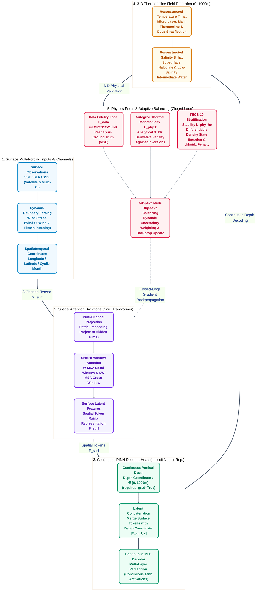

# Pinn-Ocean: Coupling Shifted Window Self-Attention with Physics-Informed Continuous Depth Representation for 3-D Ocean Thermohaline Reconstruction

[](LICENSE)
[](https://www.python.org/)
[](https://pytorch.org/)
[]()
[]()

[English](README.md) | [中文说明文档](README.zh.md)

---

## 1. Overview

Reconstructing three-dimensional (3-D) ocean temperature and salinity (thermohaline) fields from two-dimensional (2-D) satellite surface observations is critical for climate prediction (e.g., AMOC, ENSO), ocean acoustic propagation, and maritime security. While satellite altimetry and radiometry provide high-frequency, basin-wide sea surface measurements (such as Sea Level Anomaly [SLA] and Sea Surface Temperature [SST]), direct subsurface observation networks (e.g., Argo profiling floats) remain sparse and intermittent.

Traditional deep learning approaches rely on purely data-driven black-box architectures (e.g., 2-D CNNs), which often suffer from limited receptive fields, non-physical predictions (such as density inversions and abnormal thermal inversions), and finite difference truncation errors across discrete layers.

Pinn-Ocean addresses these challenges by coupling a Swin Transformer spatial backbone with a Physics-Informed Neural Network (PINN) continuous coordinate decoder. By integrating the TEOS-10 equation of state directly into the loss function via PyTorch autograd, Pinn-Ocean reconstructs continuous 3-D thermohaline fields constrained by hydrostatic and thermodynamic principles.

---

## 2. Training Data Sources

The dataset is sourced from the Copernicus Marine Service (CMEMS) and the International Argo Program.

### 2.1 Study Area and Time Horizon
- Spatial range: Northwest Pacific (145°E–165°E, 30°N–40°N), depth 0–1000m. Open ocean without land cover.
- Time range: January 2013 to December 2021 (monthly mean, 108 months).
  - Training set: 2013–2018 (72 months)
  - Validation set: 2019–2020 (24 months)
  - Test set: 2021 (12 months)

### 2.2 Dataset Inventory

| Variable | Dataset / Source | Resolution | Depth | Purpose |
| :--- | :--- | :--- | :--- | :--- |
| SLA (Sea Level Anomaly) | cmems_obs-sl_glo_phy-ssh_my_allsat-l4-duacs-0.125deg_P1M-m | 0.125° | Surface | Input feature |
| SST (Sea Surface Temperature) | METOFFICE-GLO-SST-L4-REP-OBS-SST (OSTIA) | 0.05° | Surface | Input feature |
| SSS (Sea Surface Salinity) | cmems_obs-mob_glo_phy-sal_my_multi-oi_P7D-c | 0.25° | Surface | Input feature |
| Wind U/V (Scatterometer Wind) | cmems_obs-wind_glo_phy_my_l4_P1M | 0.25° | Surface | Input feature |
| Lon / Lat / Month | Coordinate grids & cyclic month encoding | Grid-aligned | Surface | Input feature |
| Potential temp & salinity (thetao, so) | cmems_mod_glo_phy_my_0.083deg_P1M-m (GLORYS12V1) | 1/12° (~0.083°) | 0–1000m (25 levels) | Training target |
| In-situ T/S profiles | International Argo Program / China Argo Centre | Profiles | 0–1000m | Independent test |

---

## 3. Key Architecture & Methodology



### 3.1 Core Forward Mapping Formulation

The network fuses 2-D sea surface dynamics with continuous vertical coordinate $z$:

$$
[\hat{T}, \hat{S}] = f_\theta(\text{SST}, \text{SLA}, \text{SSS}, \text{SSW}_U, \text{SSW}_V, \text{Lon}, \text{Lat}, \text{Month}, z)
$$

where $z \in [0, 1000\text{ m}]$ acts as an explicit independent variable.

### 3.2 Shifted Window Self-Attention (Swin Transformer)

Spatial teleconnections are modeled via alternating local window multi-head self-attention (W-MSA) and shifted window self-attention (SW-MSA):

$$
\text{Attention}(Q, K, V) = \text{Softmax}\left(\frac{QK^T}{\sqrt{d}} + B\right) V
$$

where $B$ is the learnable relative position bias matrix.

### 3.3 Physics Prior Regularization Losses

**Thermal Monotonicity Constraint** ($\mathcal{L}_{\mathrm{phy}, T}$):

$$
\mathcal{L}_{\mathrm{phy}, T} = \frac{1}{N} \sum_{i=1}^N \mathrm{ReLU}\left(\frac{\partial \hat{T}_i}{\partial z} + \epsilon\right)
$$

**TEOS-10 Stratification Stability (Anti-Density-Inversion)** ($\mathcal{L}_{\mathrm{phy}, \rho}$):

Using the differentiable equation of state $\hat{\rho} = f_{\mathrm{TEOS\text{-}10}}(\hat{S}, \hat{T}, P)$:

$$
\mathcal{L}_{\mathrm{phy}, \rho} = \frac{1}{N} \sum_{i=1}^N \mathrm{ReLU}\left(-\frac{\partial \hat{\rho}_i}{\partial z}\right)
$$

**Adaptive Multi-Objective Balancing** ($\mathcal{L}_{\mathrm{total}}$):

$$
\mathcal{L}_{\mathrm{total}} = \exp(-\omega_1) \mathcal{L}_{\mathrm{data}} + \omega_1 + \exp(\omega_2) \mathcal{L}_{\mathrm{phy}} + \omega_2
$$

where $\omega_1, \omega_2$ are learnable dual parameters dynamically adjusted during optimization.

---

## 4. Repository Structure

```text
Pinn-Ocean/
├── configs/
│   ├── __init__.py
│   └── default_config.py      # Experiment, model, and physical loss hyperparameters
├── pinn_ocean/                # Core Python Package
│   ├── __init__.py
│   ├── models/                # Deep learning architectures
│   │   ├── __init__.py
│   │   ├── swin_blocks.py     # Swin Transformer basic building blocks (W-MSA/SW-MSA)
│   │   └── swin_ocean_pinn.py # Swin-Ocean-PINN complete end-to-end model
│   ├── losses/                # Physics & adaptive optimization losses
│   │   ├── __init__.py
│   │   ├── physics_loss.py    # Analytical Autograd gradient and stratification losses
│   │   └── adaptive_loss.py   # Adaptive multi-objective uncertainty weighting
│   ├── datasets/              # Data ingestion and IO
│   │   ├── __init__.py
│   │   ├── downloader.py      # CMEMS subsetting wrapper module
│   │   └── ocean_dataset.py   # NetCDF4 / Xarray multi-source satellite loader
│   ├── utils/                 # Marine physics & evaluation metrics
│   │   ├── __init__.py
│   │   ├── teos10.py          # Fully differentiable TEOS-10 seawater equation of state
│   │   └── metrics.py         # RMSE, MAE, R2, and Mixed Layer Depth (MLD) utilities
│   └── visualization/         # Modular scientific plotting subpackage
│       ├── __init__.py
│       ├── profiles.py        # Vertical profile comparison plotting
│       ├── ts_diagram.py      # Temperature-Salinity (T-S) consistency diagram
│       ├── scatter_density.py # Hexbin scatter density & R2 evaluation
│       └── mld.py             # Mixed Layer Depth (MLD) interface validation
├── tests/                     # Automated unit and integration test suite
│   ├── __init__.py
│   └── test_pipeline.py       # Comprehensive end-to-end verification without external data
├── checkpoints/               # Trained model checkpoint weights (.pth)
├── data/                      # Local NetCDF observation and reanalysis data
│   └── 2020/                  # Downloaded 2020 5-parameter annual dataset
├── results/                   # High-resolution (300 DPI) figures and plots
├── download_data.py           # Automated data collection tool for Open Pacific CMEMS datasets
├── train.py                   # Model training entry point
├── evaluate.py                # Model evaluation and layer-wise validation script
├── predict.py                 # Full 3-D volumetric inference & CF-compliant NetCDF exporter
├── visualize.py               # Main CLI visualization orchestrator
├── demo_test.py               # Quick verification entry point (delegates to tests/)
├── requirements.txt           # Environment dependencies
├── setup.py                   # Python package installer
├── LICENSE                    # MIT License
├── README.md                  # English Documentation
└── README.zh.md               # Chinese Documentation
```

---

## 5. Installation & Environment

### Step 1: Clone Repository
```bash
git clone https://github.com/ldray857/Pinn-Ocean.git
cd Pinn-Ocean
```

### Step 2: Set Up Conda Environment
```bash
conda create -n pinn_ocean python=3.10 -y
conda activate pinn_ocean
```

### Step 3: Install Dependencies
```bash
pip install -r requirements.txt
```

---

## 6. Quick Start & Pipeline Usage

### 6.1 Data Collection (Open Pacific 2013–2021)
Acquire satellite observations and GLORYS 3-D reanalysis for the Open Pacific basin ($145^\circ\text{E} - 165^\circ\text{E}, 30^\circ\text{N} - 40^\circ\text{N}$, zero land points):
```bash
# Preview the subsetting parameters without connecting
python download_data.py --dry_run

# Download core datasets (requires 'copernicusmarine login' first)
python download_data.py --targets sla glorys_3d
```

### 6.2 Pipeline Self-Test (No Data Needed)
Run the self-contained verification script to validate forward inference, Autograd analytical differentiation, TEOS-10 seawater density computation, and backpropagation:
```bash
python demo_test.py
```

### 6.3 Model Training
To train on regional or basin-scale NetCDF datasets (e.g., CMEMS DUACS SLA and GLORYS12V1 reanalysis):
```bash
python train.py --epochs 200 --batch_size 4 --lr 3e-4 --sampling_points 800
```

### 6.4 Model Evaluation
Evaluate a trained model checkpoint on the test set:
```bash
python evaluate.py --checkpoint checkpoints/swin_ocean_pinn_best.pth
```

### 6.5 Full 3-D Field Reconstruction & NetCDF Export
Reconstruct continuous 3D potential temperature and salinity fields and export CF-compliant NetCDF4 assets for GIS tools:
```bash
python predict.py --data_dir data/2020 --output_file data/2020/pacific_reconstructed_3d.nc
```

### 6.6 Batch Scientific Visualization
Generate publication-quality 300 DPI figures (profiles, T-S diagram, hexbin scatter density, and MLD scatter):
```bash
python visualize.py --data_dir data/2020 --output_dir results
```

---

## 7. Citation

If you find this codebase or methodology helpful in your research, please cite:

```bibtex
@article{wang2026cross,
  title={Cross-scale 3-D thermohaline modeling via dual-residual swin transformer with multisource ocean observations},
  author={Wang, An and Tang, Zhiwei and Huang, Zhanchao and Xia, Xiang-Gen and Su, Hua},
  journal={International Journal of Digital Earth},
  volume={19},
  number={1},
  pages={2607902},
  year={2026},
  publisher={Taylor \& Francis}
}

@article{shao2024attention,
  title={Optimized Attention-enhanced Physics-guided Neural Network for Satellite-based Ocean Subsurface Temperature Predicting},
  author={Shao, J. and Wu, Sensen and Chen, Y. and others},
  journal={Remote Sensing of Environment / IEEE TGRS},
  year={2024}
}
```

---

## 8. Author & Acknowledgements

*   **Principal Investigator**: Lei Di (Zhejiang University, School of Earth Sciences, GIS Major)
*   **Advisor**: Dr. Sensen Wu (School of Earth Sciences, Zhejiang University)
*   **Support**: Supported by the Zeng Xianzi Education Foundation "Top Innovative Talents Cultivation Program" (曾宪梓“拔尖创新人才培育计划”专项).

---

## 9. License

This project is open-sourced under the [MIT License](LICENSE).
