# Pinn-Ocean: Coupling Shifted Window Self-Attention with Physics-Informed Continuous Depth Representation for 3-D Ocean Thermohaline Reconstruction

[](LICENSE)
[](https://www.python.org/)
[](https://pytorch.org/)
[]()
[]()

[English](README.md) | [中文说明文档](README.zh.md)

---

## 1. Overview

Reconstructing three-dimensional (3-D) ocean temperature and salinity (thermohaline) fields from two-dimensional (2-D) satellite surface observations is critical for climate prediction (e.g., AMOC, ENSO), ocean acoustic propagation, and maritime security. While satellite altimetry and radiometry provide high-frequency, basin-wide sea surface measurements (such as Sea Level Anomaly [SLA] and Sea Surface Temperature [SST]), direct subsurface observation networks (e.g., Argo profiling floats) remain sparse and intermittent.

Traditional deep learning approaches rely on purely data-driven black-box architectures (e.g., 2-D CNNs), which often suffer from limited receptive fields, non-physical predictions (such as density inversions and abnormal thermal inversions), and finite difference truncation errors across discrete layers.

Pinn-Ocean addresses these challenges by coupling a Swin Transformer spatial backbone with a Physics-Informed Neural Network (PINN) continuous coordinate decoder. By integrating the TEOS-10 equation of state directly into the loss function via PyTorch autograd, Pinn-Ocean reconstructs continuous 3-D thermohaline fields constrained by hydrostatic and thermodynamic principles.

---

## 2. Training Data Sources

The dataset is sourced from the Copernicus Marine Service (CMEMS) and the International Argo Program.

### 2.1 Study Area and Time Horizon
- Spatial range: Northwest Pacific (145°E–165°E, 30°N–40°N), depth 0–1000m. Open ocean without land cover.
- Time range: January 2012 to December 2020 (monthly mean, 108 continuous months across 9 years).
  - Training set: 2012–2018 (84 months, 77.8%)
  - Validation set: 2019 (12 months, 11.1%)
  - Test set: 2020 (12 months, 11.1%, comprehensive annual evaluation & 447k in-situ Argo float verification)

### 2.2 Dataset Inventory

| Variable | Dataset / Source | Resolution | Depth | Purpose |
| :--- | :--- | :--- | :--- | :--- |
| SLA (Sea Level Anomaly) | cmems_obs-sl_glo_phy-ssh_my_allsat-l4-duacs-0.125deg_P1M-m | 0.125° | Surface | Input feature |
| SST (Sea Surface Temperature) | METOFFICE-GLO-SST-L4-REP-OBS-SST (OSTIA) | 0.05° | Surface | Input feature |
| SSS (Sea Surface Salinity) | cmems_obs-mob_glo_phy-sal_my_multi-oi_P7D-c | 0.25° | Surface | Input feature |
| Wind U/V (Scatterometer Wind) | cmems_obs-wind_glo_phy_my_l4_P1M | 0.25° | Surface | Input feature |
| Lon / Lat / Month | Coordinate grids & cyclic month encoding | Grid-aligned | Surface | Input feature |
| Potential temp & salinity (thetao, so) | cmems_mod_glo_phy_my_0.083deg_P1M-m (GLORYS12V1) | 1/12° (~0.083°) | 0–1000m (35 levels) | Training target |
| In-situ T/S profiles | International Argo Program / China Argo Centre | Profiles (447k points) | 0–1000m | Independent test |

---

## 3. Key Architecture & Methodology

```mermaid
%%{init: {
  'theme': 'base',
  'themeVariables': {
    'background': '#FFFFFF',
    'primaryColor': '#FFFFFF',
    'primaryBorderColor': '#CBD5E1',
    'primaryTextColor': '#0F172A',
    'secondaryColor': '#F8FAFC',
    'tertiaryColor': '#FFFFFF',
    'mainBkg': '#FFFFFF',
    'clusterBkg': '#FFFFFF',
    'clusterBorder': '#E2E8F0',
    'lineColor': '#475569',
    'textColor': '#0F172A',
    'edgeLabelBackground': '#FFFFFF',
    'fontFamily': 'system-ui, -apple-system, BlinkMacSystemFont, "Segoe UI", Roboto, sans-serif'
  }
}}%%
flowchart TD
    subgraph S1 [" "]
        direction TB
        H1["1. Surface Multi-Forcing Inputs<br/>(8 Channels)"]
        I1["Dynamic Tracers: SST / SLA / SSS"]
        I2["Boundary Forcing: Wind Stress (Wind U / V)"]
        I3["Spatiotemporal: Lon, Lat / Month Period"]
        H1 --> I1 --- I2 --- I3
    end

    subgraph S2 [" "]
        direction TB
        H2["2. Spatial Attention Backbone<br/>(Swin Transformer)"]
        E1["Patch Embedding: Hidden Dimension C"]
        E2["W-MSA / SW-MSA<br/>Local and Shifted Window Attention"]
        E3["Surface Latent Feature Token Matrix F_surf"]
        H2 --> E1 ==> E2 ==> E3
    end

    subgraph S3 [" "]
        direction TB
        H3["3. Continuous PINN Decoder<br/>(Implicit Neural Representation)"]
        D1["Vertical Depth Variable<br/>z ∈ [0, 1000m] (requires_grad)"]
        D2["Latent Concatenation: [F_surf, z] Representation"]
        D3["Continuous MLP Decoder: Smooth Tanh Activation"]
        H3 --> D1 --> D2 ==> D3
    end

    subgraph S4 [" "]
        direction TB
        H4["4. 3-D Thermohaline Field Prediction<br/>(0–1000m)"]
        O1["Reconstructed Temperature T_hat<br/>(Mixed Layer / Thermocline)"]
        O2["Reconstructed Salinity S_hat<br/>(Subsurface Halocline)"]
        H4 --> O1 --- O2
    end

    subgraph S5 [" "]
        direction TB
        H5["5. Physics Priors & Adaptive Balancing<br/>(Closed Loop)"]
        P1["Data Loss L_data: GLORYS12V1 Full-Depth MSE"]
        P2["Thermal Monotonicity L_phy,T<br/>Autograd dT/dz ≤ 0"]
        P3["Stratification Stability L_phy,rho<br/>TEOS-10 drho/dz ≥ 0"]
        Opt["Adaptive Multi-Objective Balancing<br/>& Backpropagation"]
        H5 --> P1 --- P2 --- P3 ==> Opt
    end

    I3 ==>|Surface Tensor X_surf| H2
    E3 ==>|Latent Tokens F_surf| H3
    D3 ==>|Continuous Depth Decoding| H4
    O2 ==>|3-D Physical Validation| H5
    Opt -. Closed-Loop Physical Gradient .-> H2

    style S1 fill:#FFFFFF,stroke:#0284C7,stroke-width:1.5px,stroke-dasharray: 4 4,rx:8px,ry:8px
    style S2 fill:#FFFFFF,stroke:#7C3AED,stroke-width:1.5px,stroke-dasharray: 4 4,rx:8px,ry:8px
    style S3 fill:#FFFFFF,stroke:#059669,stroke-width:1.5px,stroke-dasharray: 4 4,rx:8px,ry:8px
    style S4 fill:#FFFFFF,stroke:#D97706,stroke-width:1.5px,stroke-dasharray: 4 4,rx:8px,ry:8px
    style S5 fill:#FFFFFF,stroke:#E11D48,stroke-width:1.5px,stroke-dasharray: 4 4,rx:8px,ry:8px

    classDef headStyle1 fill:#0284C7,stroke:#0284C7,stroke-width:1.5px,color:#FFFFFF,rx:6px,ry:6px;
    classDef headStyle2 fill:#7C3AED,stroke:#7C3AED,stroke-width:1.5px,color:#FFFFFF,rx:6px,ry:6px;
    classDef headStyle3 fill:#059669,stroke:#059669,stroke-width:1.5px,color:#FFFFFF,rx:6px,ry:6px;
    classDef headStyle4 fill:#D97706,stroke:#D97706,stroke-width:1.5px,color:#FFFFFF,rx:6px,ry:6px;
    classDef headStyle5 fill:#E11D48,stroke:#E11D48,stroke-width:1.5px,color:#FFFFFF,rx:6px,ry:6px;

    classDef inputStyle fill:#F0F9FF,stroke:#0284C7,stroke-width:1.5px,color:#0369A1,rx:6px,ry:6px;
    classDef encStyle fill:#F5F3FF,stroke:#7C3AED,stroke-width:1.5px,color:#5B21B6,rx:6px,ry:6px;
    classDef pinnStyle fill:#ECFDF5,stroke:#059669,stroke-width:1.5px,color:#047857,rx:6px,ry:6px;
    classDef outStyle fill:#FFFBEB,stroke:#D97706,stroke-width:1.5px,color:#B45309,rx:6px,ry:6px;
    classDef phyStyle fill:#FFF1F2,stroke:#E11D48,stroke-width:1.5px,color:#BE123C,rx:6px,ry:6px;

    class H1 headStyle1;
    class H2 headStyle2;
    class H3 headStyle3;
    class H4 headStyle4;
    class H5 headStyle5;

    class I1,I2,I3 inputStyle;
    class E1,E2,E3 encStyle;
    class D1,D2,D3 pinnStyle;
    class O1,O2 outStyle;
    class P1,P2,P3,Opt phyStyle;
```

<div align="center">



</div>

### 3.1 Core Forward Mapping Formulation & Neural Operator Fusion

The network models the 3-D ocean reconstruction as a neural operator problem fusing 2-D sea surface dynamics with continuous vertical depth $z \in [0, 1000\,\mathrm{m}]$:

$$
[\hat{T}, \hat{S}] = \mathcal{G}_\theta\left(\mathbf{X}_{\mathrm{surf}}, \boldsymbol{\gamma}(z)\right)
$$

where $`\mathbf{X}_{\mathrm{surf}} \in \mathbb{R}^{B \times 8 \times H \times W}`$ encodes the 8 surface channels with cyclic seasonal thermal phase $`\tau_{\mathrm{season}} = -\cos\left(2\pi \frac{\text{month} - 2}{12}\right)`$, and $`\boldsymbol{\gamma}(z)`$ represents the **`DepthFourierEmbedding`** multi-scale harmonic coordinate embedding ($`z_{\mathrm{lin}}`$, $`z_{\mathrm{log}}`$, $`\sin(2^k\pi z)`$, $`\cos(2^k\pi z)`$ across 8 octaves) to overcome coordinate spectral bias.

The latent representation is fused via a **DeepONet Trunk-Branch Operator Fusion** module with multiplicative and residual connections:

$$
\mathbf{F}_{\mathrm{fused}} = \mathrm{SiLU}\left(\mathbf{F}_{\mathrm{branch}} \odot \mathbf{F}_{\mathrm{trunk}} + \mathbf{F}_{\mathrm{branch}} + \mathbf{F}_{\mathrm{trunk}}\right)
$$

followed by **decoupled dual prediction heads**: a dedicated temperature head and an expanded 3-layer MLP salinity head capable of reconstructing non-monotonic S-shaped haloclines.

### 3.2 Shifted Window Self-Attention (Swin Transformer)

Spatial teleconnections are modeled via alternating local window multi-head self-attention (W-MSA) and shifted window self-attention (SW-MSA):

$$
\text{Attention}(Q, K, V) = \text{Softmax}\left(\frac{QK^T}{\sqrt{d}} + B\right) V
$$

where $B$ is the learnable relative position bias matrix.

### 3.3 Active Ocean Physics Loss Engine

**1. Dynamic Height Anomaly (SLA) Coupling** ($\mathcal{L}_{\mathrm{sla}}$):
Using TEOS-10 in-situ density integration to match radar altimetry SLA:

$$
\Delta h_{\mathrm{steric}}(x, y) = -\frac{1}{\rho_0} \int_{0}^{H} \rho'(x, y, z) \, \mathrm{d}z, \quad \mathcal{L}_{\mathrm{sla}} = \mathrm{MSE}\left(\Delta h_{\mathrm{steric}}, \mathrm{SLA}_{\mathrm{obs}}\right)
$$

**2. Unified Sea Surface Dirichlet Boundary Anchor** ($\mathcal{L}_{\mathrm{surf}}$):
Anchors $z = 0.5\,\mathrm{m}$ predictions to satellite SST and SSS in the unified 3D target normalization frame:

$$
\mathcal{L}_{\mathrm{surf}} = \left\| \hat{T}_{\mathrm{norm}}(z_0) - \mathrm{SST}_{\mathrm{norm}} \right\|^2 + \left\| \hat{S}_{\mathrm{norm}}(z_0) - \mathrm{SSS}_{\mathrm{norm}} \right\|^2
$$

**3. Continuous Profile Derivative Supervision** ($\mathcal{L}_{\mathrm{grad}}$):
First-order finite difference gradient matching per 100m water depth:

$$
\mathcal{L}_{\mathrm{grad}} = \left\| \frac{\partial \hat{T}}{\partial z_{100}} - \frac{\partial T_{\mathrm{gt}}}{\partial z_{100}} \right\|^2 + 2 \cdot \left\| \frac{\partial \hat{S}}{\partial z_{100}} - \frac{\partial S_{\mathrm{gt}}}{\partial z_{100}} \right\|^2
$$

**4. Mixed Layer Isothermal Regularization** ($\mathcal{L}_{\mathrm{mld}}$):
Penalizes unphysical near-surface temperature curvature exceeding $0.02^\circ\mathrm{C}/\mathrm{m}$ in the upper 30m:

$$
\mathcal{L}_{\mathrm{mld}} = \frac{1}{N_{\mathrm{mld}}} \sum_{z_k \le 30\,\mathrm{m}} \mathrm{ReLU}\left( \left| \frac{\partial \hat{T}_{\mathrm{phys}}}{\partial z} \right| - 0.02^\circ\mathrm{C}/\mathrm{m} \right)
$$

**5. Brunt-Väisälä Buoyancy Frequency Stratification Stability ($N^2$)** ($\mathcal{L}_{\mathrm{buoyancy}}$):
In physical oceanography, surface-referenced potential density $\sigma_0$ suffers from thermobaricity at depth. Following international TEOS-10 standards, static stability is strictly governed by the local Brunt-Väisälä buoyancy frequency squared $N^2$, evaluated at the shared local midpoint pressure $P_{\mathrm{mid}}$:

$$
N^2 = g \frac{\rho(S_{k+1}, T_{k+1}, P_{\mathrm{mid}}) - \rho(S_k, T_k, P_{\mathrm{mid}})}{\rho_{\mathrm{mid}} \Delta z}
$$

Convective instability ($N^2 < 0$) is penalized via a continuous, differentiable softplus formulation:

$$
\mathcal{L}_{\mathrm{buoyancy}} = \frac{1}{M} \sum \mathrm{Softplus}\left(- 10^4 \cdot N^2\right)
$$

**6. Adaptive Multi-Objective Balancing** ($\mathcal{L}_{\mathrm{total}}$):

$$
\mathcal{L}_{\mathrm{total}} = \exp(-\omega_1) \mathcal{L}_{\mathrm{data}} + \omega_1 + \exp(-\omega_2) \mathcal{L}_{\mathrm{phy}} + \omega_2
$$

where $\omega_1, \omega_2$ are learnable homoscedastic log-variance dual parameters dynamically adjusted during optimization.

---

## 4. Repository Structure

```text
Pinn-Ocean/
├── configs/                   # Configuration management
│   ├── __init__.py
│   └── default_config.py      # Model, 5-term physics loss weights, and 2012–2020 9-year dataset splits
├── pinn_ocean/                # Core Python Package
│   ├── __init__.py
│   ├── models/                # Deep learning architectures
│   │   ├── __init__.py
│   │   ├── swin_blocks.py     # Swin Transformer basic building blocks (W-MSA/SW-MSA/PatchMerging)
│   │   └── swin_ocean_pinn.py # Swin-Ocean-PINN continuous neural operator model with coordinate decoder
│   ├── losses/                # Physics-informed & adaptive optimization losses
│   │   ├── __init__.py
│   │   ├── physics_loss.py    # 5-term active physics loss (SLA steric, TEOS-10 stability, surface, gradient, MLD)
│   │   └── adaptive_loss.py   # Kendall & Gal Bayesian homoscedastic uncertainty multi-objective weighting
│   ├── datasets/              # Data ingestion and IO
│   │   ├── __init__.py
│   │   ├── downloader.py      # CMEMS subsetting wrapper module
│   │   └── ocean_dataset.py   # NetCDF4 / Xarray multi-year automatic concatenation loader (2012–2020 9-year sequence)
│   ├── utils/                 # Marine physics & evaluation metrics
│   │   ├── __init__.py
│   │   ├── teos10.py          # Differentiable TEOS-10 seawater equation of state & local-pressure N^2 calculation
│   │   ├── io.py              # Standardized result/<year_tag>/ directory manager and safe netCDF exporter
│   │   └── metrics.py         # RMSE, MAE, R^2, MLD, CIR, TMV 4-tier academic evaluation metrics
│   └── visualization/         # Modular scientific plotting subpackage (publication styling)
│       ├── __init__.py
│       ├── horizontal_layers.py # 50m-interval layer-by-layer horizontal depth slices (0-1000m)
│       ├── profiles.py        # Vertical profiles (multi-station dynamic regime array & auto-best station)
│       ├── sections.py        # 2D continuous vertical sections (35°N transect) & layer-wise error profiles
│       ├── volumetric_3d.py   # True 3D isotherm surface topography & volume slices
│       ├── ts_diagram.py      # Temperature-Salinity (T-S) consistency diagram
│       ├── scatter_density.py # Hexbin scatter density & R^2 evaluation
│       ├── mld.py             # Mixed Layer Depth (MLD) interface validation
│       └── benchmark_viz.py   # Multi-model 6-axis superiority radar, transect stability & summary bar chart
├── tests/                     # Automated unit and integration test suite
│   ├── __init__.py
│   └── test_pipeline.py       # Comprehensive end-to-end verification without external data
├── docs/                      # Research reports and scientific documentation
│   ├── image/                 # Report figures and architecture illustrations
│   ├── research_report.md     # Comprehensive academic research report with formal mathematical analysis
│   └── 研究报告.md             # Chinese 2012–2020 9-year comprehensive scientific report
├── data/                      # Local NetCDF observation and reanalysis data (partitioned by year)
│   ├── 2012/ ~ 2020/          # 2012–2020 9-year 5-parameter yearly NetCDF datasets (SLA/SST/SSS/Wind/GLORYS 3D)
│   ├── argo/                  # In-situ Argo physical float observation NetCDF datasets (79 floats, year 2020)
│   └── .gitkeep
├── result/                    # Standardized experiment output root directory
│   └── 2012_2020/             # 2012–2020 9-year experiment asset bundle
│       ├── checkpoints/       # Best model checkpoint (swin_ocean_pinn_best.pth)
│       ├── log/               # Training & evaluation logs, summary metrics, and reports
│       │   ├── train.log              # 300-epoch training convergence log with adaptive weights
│       │   ├── eval.log               # 2020 blind test set 4-tier academic evaluation log
│       │   ├── metrics_detailed.json  # 3D full-depth layer-wise quantitative errors & physical compliance
│       │   ├── benchmark_summary.json # Quantitative benchmark metrics across 3 models
│       │   ├── benchmark_report.md    # Academic superiority benchmark report
│       │   ├── argo_validation_summary.json # 79 in-situ floats (447,292 points) validation metrics
│       │   └── argo_validation_report.md    # In-situ Argo float independent generalization report
│       ├── pic/               # Publication-grade 300 DPI figures organized into 5 categorized subdirectories
│       │   ├── 01_spatial_layers/        # Fig01 ~ Fig02: 50m-interval subsurface horizontal slices
│       │   ├── 02_vertical_profiles/     # Fig03 ~ Fig04: Vertical profiles & layer-wise error curves
│       │   ├── 03_physical_diagnostics/  # Fig05 ~ Fig06: T-S diagram & hexbin scatter density
│       │   ├── 04_superiority_benchmark/ # Fig07 ~ Fig10: Superiority radar, transect stability, super-res & bar summary
│       │   └── 05_argo_validation/       # Fig11 ~ Fig14: 79 in-situ Argo floats (44.7w points) independent validation
│       └── con/               # 3-D volumetric NetCDF & ArcGIS Pro 10m regular voxel layers
│           ├── pacific_reconstructed_3d_test.nc         # Full-depth 25-layer non-uniform reconstructed 3D netCDF
│           └── pacific_reconstructed_3d_test_regular.nc # ArcGIS Pro 10m regular 101-layer voxel digital twin
├── download_data.py           # Automated data collection tool for Open Pacific CMEMS datasets
├── download_argo.py           # In-situ Argo float profile data acquisition tool via argopy
├── train.py                   # Model training entry point (2012–2020 9-year sequence & active physics)
├── evaluate.py                # Model evaluation and 4-tier physics/layer validation engine
├── predict.py                 # Full 3-D volumetric inference & dual CF-compliant NetCDF exporter
├── visualize.py               # Main CLI visualization orchestrator (50m layers, sections & profiles)
├── benchmark.py               # Multi-model superiority benchmark runner (Pure-CNN / Pure-Swin / PINN)
├── validate_argo.py           # Real in-situ Argo float generalization validation runner (44.7w points)
├── super_resolve.py           # GLORYS continuous super-resolution interpolation and diagnostic tool
├── demo_test.py               # Quick verification entry point (delegates to tests/)
├── requirements.txt           # Environment dependencies
├── setup.py                   # Python package installer
├── LICENSE                    # MIT License
├── README.md                  # English Documentation
└── README.zh.md               # Chinese Documentation
```

---

## 5. Installation & Environment

### (a) Clone Repository
```bash
git clone https://github.com/ldray857/Pinn-Ocean.git
cd Pinn-Ocean
```

### (b) Create and Activate Conda Environment
```bash
conda create -n pinn_ocean python=3.10 -y
conda activate pinn_ocean
```

### (c) Install Dependencies
```bash
pip install -r requirements.txt
```

---

## 6. Experiments and Verification (2012–2020 Nine-Year Full Sequence, 300 Epochs)

### 6.1 Data Acquisition

The project provides standard automated scripts to subset and download multi-source satellite observations and 3-D reanalysis for the Northwest Pacific open ocean (145°E–165°E, 30°N–40°N, depth 0.49–1000 m), with support for **automatic yearly subdirectories** (e.g. `data/2012` ~ `data/2020` via `--by_year`, enabled by default):

```bash
# Preview subsetting parameters and yearly breakdown without downloading
python download_data.py --dry_run

# Download 2012–2020 nine-year (108-month) all 5 variables partitioned by year into data/2012 ~ data/2020
python download_data.py --output_dir data --start_time 2012-01-01 --end_time 2020-12-31 --targets all --by_year
```

### 6.2 Code Self-Inspection
This self-contained verification suite uses synthetic mini-batches to validate Swin-Ocean-PINN forward inference, Autograd analytical differentiation, TEOS-10 density computation, multi-objective backward pass, and 2D/3D visualization pipelines:
```bash
python demo_test.py
```

### 6.3 Model Training (Cosine Annealing & Active Physics)
Train on the 2012–2020 nine-year sequence (84 train months, 12 val months, 12 test months) with active physics constraints, utilizing Cosine Annealing learning rate scheduling, 50-epoch early stopping, and TEOS-10 buoyancy stability:
```bash
python train.py \
  --data_dir data \
  --tag 2012_2020 \
  --epochs 300 \
  --batch_size 4 \
  --lr 3e-4 \
  --scheduler cosine \
  --patience 50 \
  --sampling_points 1500 \
  --device cuda
```
* **Convergence Profile**:
  * Early stopping triggered at Epoch 252 (50 consecutive epochs without validation loss improvement);
  * Optimal model checkpoint saved at **Epoch 202** (Validation Loss: **0.075193**);
  * Training logs saved to `result/2012_2020/log/train.log`;
  * Model weights preserved at `result/2012_2020/checkpoints/swin_ocean_pinn_best.pth`.

### 6.4 Model Evaluation & Physical Stratification Benchmarks
Evaluate the trained checkpoint on the independent 2020 test set (12 time steps, 12,247,620 3-D grid points) with comprehensive physical oceanographic metrics:
```bash
python evaluate.py \
  --data_dir data \
  --tag 2012_2020 \
  --mode test \
  --checkpoint result/2012_2020/checkpoints/swin_ocean_pinn_best.pth \
  --device cuda
```

**1. Four-Tier Evaluation Architecture & Benchmark Results (2020 Independent Test Set)**:

| Dynamical Regime | Depth Range | Temp RMSE (°C) | Temp MAE (°C) | Temp $R^2$ | Sal RMSE (PSU) | Sal MAE (PSU) | Sal $R^2$ |
| :--- | :---: | :---: | :---: | :---: | :---: | :---: | :---: |
| **Mixed Layer** | 0–100 m | **1.0252** | **0.7712** | **0.9466** | **0.1023** | **0.0768** | **0.8612** |
| **Thermocline** | 100–400 m | **1.7737** | **1.3916** | **0.8260** | **0.0772** | **0.0573** | **0.9404** |
| **Deep Layer** | 400–1000 m | 2.5498 | 2.2351 | 0.3385 | **0.0564** | **0.0440** | **0.8438** |
| **Global Overall** | **0–1000 m** | **1.5194** | **1.1443** | **0.9428** | **0.0916** | **0.0670** | **0.9048** |

**2. Physical Consistency & Stratification Diagnostics**:
* **Brunt-Väisälä Convective Instability Rate (CIR, $N^2 < 0$)**: Swin-Ocean-PINN reaches **3.537%** (mean $N^2 = 7.54 \times 10^{-5}\,\mathrm{s}^{-2}$), closely aligning with Copernicus GLORYS12V1 high-resolution ocean reanalysis truth (**1.153%**, mean $N^2 = 7.19 \times 10^{-5}\,\mathrm{s}^{-2}$). Computed via the international TEOS-10 shared local midpoint pressure formulation, strictly resolving deep thermobaric false inversions.
* **Thermocline Thermal Monotonicity Violation (TMV)**: **0.049%** (only 2,069 out of 4,199,184 deep vertical point pairs violating $dT/dz \le 0$), completely preventing unphysical deep thermal oscillations.
* **In-Situ Density Inversion Rate (DIR)**: Controlled at **0.446%** across the full water column.
* **Pycnocline Depth Accuracy ($\arg\max_z N^2(z)$)**: Resolves primary oceanic pycnocline depth with $\mathrm{MAE} = 102.58\,\mathrm{m}$ and $\mathrm{RMSE} = 177.87\,\mathrm{m}$.
* **Mixed Layer Depth (MLD) Accuracy**: $\mathrm{MAE} = 48.21\,\mathrm{m}$, $\mathrm{RMSE} = 77.18\,\mathrm{m}$ under standard $\Delta T = 0.5^\circ\mathrm{C}$ threshold.

### 6.5 Full 3-D Field Reconstruction & Dual NetCDF4 Asset Export
The pipeline automatically exports two complementary CF-1.8 standard NetCDF4 data assets directly into `result/2012_2020/con/`:
1. **GLORYS-Aligned Asset (35 layers)**: `result/2012_2020/con/pacific_reconstructed_3d_test.nc` (**186.90 MB**), exactly aligned with GLORYS12V1 vertical grid with both predictions and residual metrics;
2. **Strictly Regular Voxel Asset (101 layers, 10m interval)**: `result/2012_2020/con/pacific_reconstructed_3d_test_regular.nc` (**269.66 MB**), exploits continuous-coordinate PINN representations to reconstruct strictly equal-interval 10m vertical voxels, natively compatible with ArcGIS Pro 3.x Voxel Layer.

```bash
# Export both aligned and 10m regular voxel NetCDF4 files in one pass
python predict.py \
  --data_dir data \
  --tag 2012_2020 \
  --mode test \
  --checkpoint result/2012_2020/checkpoints/swin_ocean_pinn_best.pth \
  --export_regular \
  --regular_step 10.0 \
  --device cuda
```

### 6.6 Publication-Quality Visualization Suite
Generate publication-quality 300 DPI figures exported directly into categorized subdirectories under `result/2012_2020/pic/`:
```bash
python visualize.py \
  --data_dir data \
  --tag 2012_2020 \
  --checkpoint result/2012_2020/checkpoints/swin_ocean_pinn_best.pth \
  --output_dir result/2012_2020/pic \
  --device cuda
```

**Generated Figure Suite (Fully Generated & Categorized)**:
* **`01_spatial_layers/`** (Subsurface Horizontal Slices):
  * **`Fig01_depth_layers_50m_temp.png`**: 50m-interval layer-by-layer horizontal depth slice evaluation for temperature (0–1000m overview);
  * **`Fig02_depth_layers_50m_sal.png`**: 50m-interval layer-by-layer horizontal depth slice evaluation for salinity (0–1000m overview);
* **`02_vertical_profiles/`** (Vertical Profiles & Error Metrics):
  * **`Fig03_layer_metrics_depth.png`**: Continuous layer-wise RMSE(z), MAE(z), and $R^2(z)$ profiles across 0–1000m depth;
  * **`Fig04_multi_station_profiles.png`**: Multi-station profile array comparing 4 contrasting dynamic regimes (Kuroshio Jet, Subtropical Warm Pool, Subarctic Water, Open Ocean Center);
* **`03_physical_diagnostics/`** (Physical Consistency & Correlation):
  * **`Fig05_ts_diagram.png`**: Temperature-Salinity (T-S) water mass diagram with potential density ($\sigma_\theta$) isopycnal contours;
  * **`Fig06_scatter_density.png`**: Full-depth Hexbin scatter density plot with 1:1 reference line.

### 6.7 GLORYS 3-D Continuous Super-Resolution & Spatial Downscaling
Empowered by continuous Fourier depth embeddings and neural decoding, the framework supports arbitrary horizontal downscaling (e.g. 2x, 4x) and arbitrary vertical regular voxel interpolation (e.g. 10m intervals):
```bash
python super_resolve.py \
  --data_dir data \
  --checkpoint result/2012_2020/checkpoints/swin_ocean_pinn_best.pth \
  --scale_factor 2.0 \
  --depth_step 10.0 \
  --output_file result/2012_2020/con/pacific_glorys_super_res_3d_pinn_test.nc \
  --device cuda
```

### 6.8 Multi-Model Academic Superiority Benchmark Suite
Evaluates contrasting paradigms: Pure-CNN (2D CNN without physics), Pure-Swin (Ablation without physics loss), and Swin-Ocean-PINN (Our complete model), generating structured reports and 4 publication-grade comparative figures:

```bash
python benchmark.py \
  --data_dir data \
  --tag 2012_2020 \
  --checkpoint result/2012_2020/checkpoints/swin_ocean_pinn_best.pth \
  --output_dir result/2012_2020/pic \
  --device cuda
```

**Multi-Model Superiority Evaluation Summary**:

| Model Architecture | Convective Instability (CIR) | Density Inversion (DIR) | Thermal Monotonicity (TMV) | Thermocline Sal-RMSE | Superiority Score (/100) |
| :--- | :---: | :---: | :---: | :---: | :---: |
| **Pure-CNN (No Physics)** | 31.53% | 24.26% | 4.68% | 0.0554 PSU | 45.12 |
| **Pure-Swin (Ablation)** | 5.40% | 0.45% | 0.073% | 0.0813 PSU | 65.33 |
| **Swin-Ocean-PINN (Ours)** | **3.54%** | **0.45%** | **0.049%** | **0.0772 PSU** | **68.11** |

* **Benchmark Visualization Artifacts** (saved in `result/2012_2020/pic/04_superiority_benchmark/`):
  * **`Fig07_superiority_radar.png`**: Multi-model 6-dimensional superiority radar chart;
  * **`Fig08_physics_stability_transect.png`**: 35°N Kuroshio vertical transect stability & convective instability patch ($N^2 < 0$) overlay;
  * **`Fig09_glorys_super_resolution.png`**: High-resolution super-resolution comparison with mesoscale eddy inset zoom;
  * **`Fig10_superiority_bar_summary.png`**: Key metric error reduction & ablation improvement bar summary;
  * **Reports**: `result/2012_2020/log/benchmark_summary.json` and `benchmark_report.md`.

### 6.9 Independent Third-Party In-Situ Argo Float Verification
To support rigorous empirical validation against real-world in-situ observations, the model predictions are evaluated against 447,292 discrete sounding points from 79 profiling floats in 2020 across the Northwest Pacific:

```bash
python validate_argo.py \
  --data_dir data \
  --tag 2012_2020 \
  --argo_nc data/argo/2020/argo_pacific_2020.nc \
  --checkpoint result/2012_2020/checkpoints/swin_ocean_pinn_best.pth \
  --device cuda
```

**Key Findings from 447,292 In-Situ Argo Soundings**:
1. **Macro-Scale Profiling Accuracy**:
   - Full-Depth Temperature: $\mathrm{RMSE} = \mathbf{2.1952^\circ\mathrm{C}}$, $\mathrm{MAE} = 1.8301^\circ\mathrm{C}$, correlation $R = \mathbf{0.9313}$ ($R^2 = 0.8665$);
   - Full-Depth Salinity: $\mathrm{RMSE} = \mathbf{0.1006\,\mathrm{PSU}}$, $\mathrm{MAE} = 0.0721\,\mathrm{PSU}$, correlation $R = \mathbf{0.9359}$ ($R^2 = 0.8727$);
2. **Superior Performance over Numerical Reanalysis (Key Defense Asset)**:
   - Without assimilating in-situ float data, **Swin-Ocean-PINN's full-depth salinity RMSE (0.1006 PSU) surpasses the heavy numerical reanalysis GLORYS12V1 (0.1059 PSU)**;
   - Upper Mixed Layer (0–50m): PINN Temp RMSE (1.5648°C) outperforms GLORYS (1.5909°C); PINN Sal RMSE (0.1367 PSU) outperforms GLORYS (0.1373 PSU);
   - Core Thermocline (100–200m): PINN Sal RMSE (0.1083 PSU) outperforms GLORYS (0.1180 PSU);
   - Deep Abyss (700–1000m): PINN Sal RMSE (0.0572 PSU) substantially outperforms GLORYS (0.0746 PSU).
* **Generated In-Situ Argo Figures & Reports** (saved in `result/2012_2020/pic/05_argo_validation/` and `result/2012_2020/log/`):
  * **`Fig11_argo_multi_profile_validation.png`**: Multi-station vertical profile validation (Argo In-situ vs PINN vs GLORYS);
  * **`Fig12_argo_vertical_error_profiles.png`**: Vertical error decay profiles against true floats;
  * **`Fig13_argo_ts_diagram_comparison.png`**: Real-world T-S water mass diagram fidelity;
  * **`Fig14_argo_scatter_hexbin_density.png`**: 447k in-situ observation scatter density correlation;
  * **Report**: `result/2012_2020/log/argo_validation_report.md` and `argo_validation_summary.json`.

---


## 7. Citation

If you find this codebase or methodology helpful in your research, please cite:

```bibtex
@article{wang2026cross,
  title={Cross-scale 3-D thermohaline modeling via dual-residual swin transformer with multisource ocean observations},
  author={Wang, An and Tang, Zhiwei and Huang, Zhanchao and Xia, Xiang-Gen and Su, Hua},
  journal={International Journal of Digital Earth},
  volume={19},
  number={1},
  pages={2607902},
  year={2026},
  publisher={Taylor \& Francis}
}

@article{shao2024attention,
  title={Optimized Attention-enhanced Physics-guided Neural Network for Satellite-based Ocean Subsurface Temperature Predicting},
  author={Shao, J. and Wu, Sensen and Chen, Y. and others},
  journal={Remote Sensing of Environment / IEEE TGRS},
  year={2024}
}
```

---

## 8. Author & Acknowledgements

*   **Principal Investigator**: Lei Di (Zhejiang University, School of Earth Sciences, GIS Major)
*   **Advisor**: Dr. Sensen Wu (School of Earth Sciences, Zhejiang University)
*   **Support**: Supported by the Zeng Xianzi Education Foundation "Top Innovative Talents Cultivation Program" (曾宪梓“拔尖创新人才培育计划”专项).

---

## 9. License

This project is open-sourced under the [MIT License](LICENSE).
