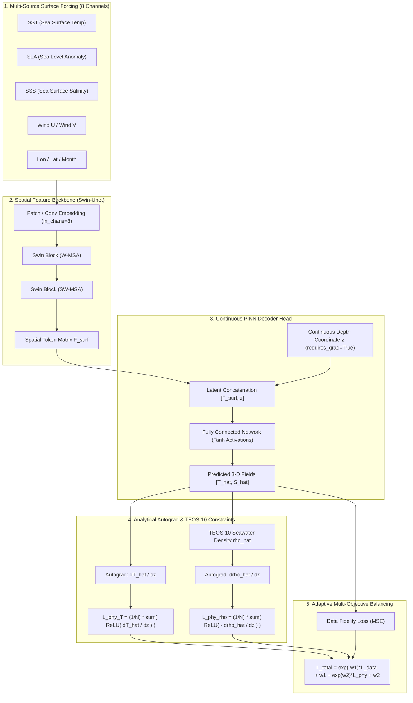

# Pinn-Ocean: Coupling Shifted Window Self-Attention with Physics-Informed Continuous Depth Representation for 3-D Ocean Thermohaline Reconstruction

[](LICENSE)
[](https://www.python.org/)
[](https://pytorch.org/)
[]()
[]()

[English](README.md) | [中文说明文档](README.zh.md)

---

## 1. Overview

Reconstructing three-dimensional (3-D) ocean temperature and salinity (thermohaline) fields from two-dimensional (2-D) satellite surface observations is critical for climate prediction (e.g., AMOC, ENSO), ocean acoustic propagation, and maritime security. While satellite altimetry and radiometry provide high-frequency, basin-wide sea surface measurements (such as Sea Level Anomaly [SLA] and Sea Surface Temperature [SST]), direct subsurface observation networks (e.g., Argo profiling floats) remain sparse and intermittent.

Traditional deep learning approaches rely on purely data-driven black-box architectures (e.g., 2-D CNNs), which often suffer from:
1. **Limited Receptive Fields**: Difficulties in capturing multiscale ocean teleconnections and mesoscale eddy interactions.
2. **Physical Paradoxes**: Non-physical predictions in unobserved subsurface zones, most notably abnormal thermal inversions and catastrophic **density inversions** (lighter seawater trapped beneath denser layers).
3. **Finite Difference Truncation Errors**: Accumulation of errors when stacking discrete layers.

**Pinn-Ocean** solves these limitations by coupling a **Shifted Window Self-Attention (Swin Transformer)** spatial backbone with a **Physics-Informed Neural Network (PINN)** continuous coordinate decoder. By integrating the international standard **TEOS-10 equation of state** directly into the loss function via analytical automatic differentiation (`autograd`), Pinn-Ocean reconstructs high-fidelity 3-D thermohaline structures that strictly obey fundamental hydrostatic and thermodynamic principles.

---

## 2. Key Architecture & Methodology



### 2.1 Forward Mapping Formulation

The model establishes a continuous mapping function from surface dynamics and continuous vertical depth to 3-D thermohaline properties:

$$
[\hat{T}, \hat{S}] = f_\theta(\text{SST}, \text{SLA}, \text{SSS}, \text{SSW}_U, \text{SSW}_V, \text{Lon}, \text{Lat}, \text{Month}, z)
$$

where $z \in [0, 1000\text{ m}]$ is the explicit continuous depth coordinate.

### 2.2 Shifted Window Attention (Swin-Unet)

Spatial tokens are processed using alternating Window Multi-Head Self-Attention (W-MSA) and Shifted Window Multi-Head Self-Attention (SW-MSA):

$$
\text{Attention}(Q, K, V) = \text{Softmax}\left(\frac{QK^T}{\sqrt{d}} + B\right) V
$$

where $B$ is the learnable relative position bias matrix.

### 2.3 Domain Physics Constraints

**Vertical Temperature Monotonicity Constraint** ($\mathcal{L}_{\mathrm{phy}, T}$):

$$
\mathcal{L}_{\mathrm{phy}, T} = \frac{1}{N} \sum_{i=1}^N \mathrm{ReLU}\left(\frac{\partial \hat{T}_i}{\partial z} + \epsilon\right)
$$

**TEOS-10 Stratification Stability Constraint** ($\mathcal{L}_{\mathrm{phy}, \rho}$):

Preventing unphysical density inversions based on the in-situ density $\hat{\rho} = f_{\mathrm{TEOS\text{-}10}}(\hat{S}, \hat{T}, P)$:

$$
\mathcal{L}_{\mathrm{phy}, \rho} = \frac{1}{N} \sum_{i=1}^N \mathrm{ReLU}\left(-\frac{\partial \hat{\rho}_i}{\partial z}\right)
$$

**Adaptive Multi-Objective Loss Balancing** ($\mathcal{L}_{\mathrm{total}}$):

$$
\mathcal{L}_{\mathrm{total}} = \exp(-\omega_1) \mathcal{L}_{\mathrm{data}} + \omega_1 + \exp(\omega_2) \mathcal{L}_{\mathrm{phy}} + \omega_2
$$

where $\omega_1, \omega_2$ are learnable dual parameters that eliminate the need for manual hyperparameter tuning.

---

## 3. Repository Structure

```text
Pinn-Ocean/
├── configs/
│   ├── __init__.py
│   └── default_config.py      # Experiment, model, and physical loss hyperparameters
├── pinn_ocean/
│   ├── __init__.py
│   ├── models/
│   │   ├── __init__.py
│   │   ├── swin_blocks.py     # Swin Transformer basic building blocks (W-MSA/SW-MSA)
│   │   └── swin_ocean_pinn.py # Swin-Ocean-PINN complete end-to-end model
│   ├── losses/
│   │   ├── __init__.py
│   │   ├── physics_loss.py    # Analytical Autograd gradient and stratification losses
│   │   └── adaptive_loss.py   # Adaptive multi-objective uncertainty weighting
│   ├── datasets/
│   │   ├── __init__.py
│   │   └── ocean_dataset.py   # NetCDF4 / Xarray multi-source satellite loader
│   └── utils/
│       ├── __init__.py
│       ├── teos10.py          # Fully differentiable TEOS-10 seawater equation of state
│       └── metrics.py         # RMSE, MAE, R2, and Mixed Layer Depth (MLD) utilities
├── train.py                   # Model training entry point
├── evaluate.py                # Model evaluation and layer-wise validation script
├── demo_test.py               # Self-contained pipeline unit test (no external data required)
├── requirements.txt           # Environment dependencies
├── setup.py                   # Python package installer
├── LICENSE                    # MIT License
├── README.md                  # English Documentation
└── README.zh.md               # Chinese Documentation
```

---

## 4. Installation & Environment

### Step 1: Clone Repository
```bash
git clone https://github.com/ldray857/Pinn-Ocean.git
cd Pinn-Ocean
```

### Step 2: Set Up Conda Environment
```bash
conda create -n pinn_ocean python=3.10 -y
conda activate pinn_ocean
```

### Step 3: Install Dependencies
```bash
pip install -r requirements.txt
```

---

## 5. Quick Start

### 5.1 Pipeline Self-Test (No Data Needed)
Run the self-contained verification script to validate forward inference, Autograd analytical differentiation, TEOS-10 seawater density computation, and backpropagation:
```bash
python demo_test.py
```

### 5.2 Model Training
To train on regional or basin-scale NetCDF datasets (e.g., CMEMS DUACS SLA and GLORYS12V1 reanalysis):
```bash
python train.py --epochs 200 --batch_size 4 --lr 3e-4 --sampling_points 800
```

### 5.3 Model Evaluation
Evaluate a trained model checkpoint on the test set:
```bash
python evaluate.py --checkpoint checkpoints/swin_ocean_pinn_best.pth
```

---

## 6. Citation

If you find this codebase or methodology helpful in your research, please cite:

```bibtex
@article{wang2026cross,
  title={Cross-scale 3-D thermohaline modeling via dual-residual swin transformer with multisource ocean observations},
  author={Wang, An and Tang, Zhiwei and Huang, Zhanchao and Xia, Xiang-Gen and Su, Hua},
  journal={International Journal of Digital Earth},
  volume={19},
  number={1},
  pages={2607902},
  year={2026},
  publisher={Taylor \& Francis}
}

@article{shao2024attention,
  title={Optimized Attention-enhanced Physics-guided Neural Network for Satellite-based Ocean Subsurface Temperature Predicting},
  author={Shao, J. and Wu, Sensen and Chen, Y. and others},
  journal={Remote Sensing of Environment / IEEE TGRS},
  year={2024}
}
```

---

## 7. Author & Acknowledgements

*   **Principal Investigator**: Lei Di (Zhejiang University, School of Earth Sciences, GIS Major)
*   **Advisor**: Dr. Sensen Wu (School of Earth Sciences, Zhejiang University)
*   **Support**: Supported by the Zeng Xianzi Education Foundation "Top Innovative Talents Cultivation Program" (曾宪梓“拔尖创新人才培育计划”专项).

---

## 8. License

This project is open-sourced under the [MIT License](LICENSE).
