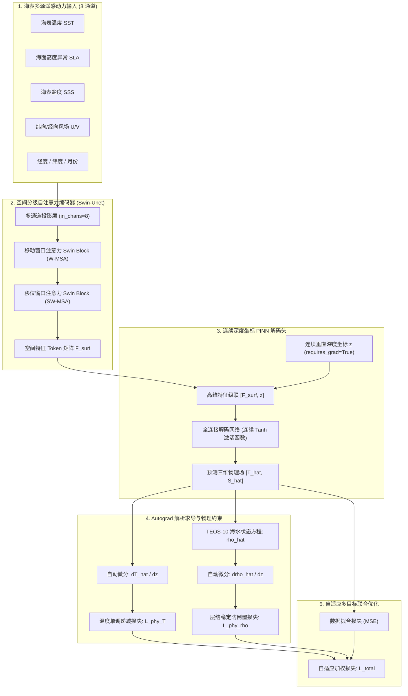

# Pinn-Ocean: 耦合移位窗口自注意力与物理约束连续坐标的海洋三维温盐场重建框架

[](LICENSE)
[](https://www.python.org/)
[](https://pytorch.org/)
[]()
[]()

[English](README.md) | [中文说明文档](README.zh.md)

---

## 一、 项目背景与科学问题

利用海表高频二维卫星观测（海表温度 SST、海面高度异常 SLA、海表盐度 SSS、风场等）高保真反演海洋次表层（0–1000m）三维温度和盐度场，对全球气候事件（AMOC、ENSO）预警、水下声传播路径模拟以及国家海洋国土安全保障具有重大战略价值。

传统原位观测网络（如 Argo 浮标网）在时空覆盖上存在明显的稀疏性与滞后性；而传统深度学习方法（如二维 CNN 逐层堆叠）常面临三大瓶颈：
1. **感受野受限**：难以捕获大洋多尺度动力关联与中尺度涡旋空间遥相关；
2. **违背物理法则**：纯数据驱动的“黑盒”模型在观测盲区极易出现违背热力学常识的现象，最典型的是深层海水密度小于表层的**“反常密度倒置”**与异常逆温；
3. **有限差分离散误差**：逐层网格计算使得垂直导数截断误差随深度累积，深层反演精度急剧下降。

针对上述瓶颈，**Pinn-Ocean (Swin-Ocean-PINN)** 提出了一套**耦合 Swin Transformer 空间自注意力与物理信息神经网络（PINN）连续坐标解码的端到端框架**。通过引入 PyTorch `autograd` 自动微分机制，直接将国际公认的 **TEOS-10 海水状态方程** 与海水静力学层结稳定条件构建为全链路可微的损失正则项，实现了高拟合精度与严谨热力学一致性的统一。

---

## 二、 核心算法与网络架构



### 2.1 核心前向映射函数

网络将海表二维多动力参数与连续垂直深度坐标 $z$ 显式融合，建立高维连续重构映射：

$$
[\hat{T}, \hat{S}] = f_\theta(\text{SST}, \text{SLA}, \text{SSS}, \text{SSW}_U, \text{SSW}_V, \text{Lon}, \text{Lat}, \text{Month}, z)
$$

其中 $z \in [0, 1000\text{ m}]$ 为显式自变量，赋予模型在垂直方向上任意连续深度的解析能力。

### 2.2 空间移位窗口自注意力 (Swin Transformer)

利用局部窗口多头自注意力（W-MSA）与跨窗口移位自注意力（SW-MSA）交替提取海表特征，计算公式如下：

$$
\text{Attention}(Q, K, V) = \text{Softmax}\left(\frac{QK^T}{\sqrt{d}} + B\right) V
$$

其中 $B$ 为相对位置偏置矩阵，使得模型能够在大洋尺度下高效建模长距离空间遥相关。

### 2.3 物理先验约束损失系统

**温度垂直单调递减约束**（$\mathcal{L}_{\mathrm{phy}, T}$）：

$$
\mathcal{L}_{\mathrm{phy}, T} = \frac{1}{N} \sum_{i=1}^N \operatorname{ReLU}\left(\frac{\partial \hat{T}_i}{\partial z} + \epsilon\right)
$$

**TEOS-10 层结稳定性与防密度倒置约束**（$\mathcal{L}_{\mathrm{phy}, \rho}$）：

基于海水状态方程 $\hat{\rho} = f_{\mathrm{TEOS\text{-}10}}(\hat{S}, \hat{T}, P)$，惩罚违背静力平衡的密度倒置：

$$
\mathcal{L}_{\mathrm{phy}, \rho} = \frac{1}{N} \sum_{i=1}^N \operatorname{ReLU}\left(-\frac{\partial \hat{\rho}_i}{\partial z}\right)
$$

**自适应多目标联合优化**（$\mathcal{L}_{\mathrm{total}}$）：

$$
\mathcal{L}_{\mathrm{total}} = \exp(-\omega_1) \mathcal{L}_{\mathrm{data}} + \omega_1 + \exp(\omega_2) \mathcal{L}_{\mathrm{phy}} + \omega_2
$$

其中 $\omega_1, \omega_2$ 为可学习的对偶参数，在训练中自适应平衡数据保真度与物理约束。

---

## 三、 工程目录结构

```text
Pinn-Ocean/
├── configs/
│   ├── __init__.py
│   └── default_config.py      # 模型维度、物理损失超参数及路径配置文件
├── pinn_ocean/
│   ├── __init__.py
│   ├── models/
│   │   ├── __init__.py
│   │   ├── swin_blocks.py     # Swin Transformer 基础模块 (W-MSA/SW-MSA/PatchMerge/Expand)
│   │   └── swin_ocean_pinn.py # Swin-Ocean-PINN 端到端核心拓扑架构
│   ├── losses/
│   │   ├── __init__.py
│   │   ├── physics_loss.py    # 基于 Autograd 的温度梯度与密度层结稳定物理损失算子
│   │   └── adaptive_loss.py   # 自适应多目标损失平衡算法
│   ├── datasets/
│   │   ├── __init__.py
│   │   └── ocean_dataset.py   # 支持 NetCDF4 / Xarray 的 8 通道空间网格数据加载管道
│   └── utils/
│       ├── __init__.py
│       ├── teos10.py          # 全链路可微的 TEOS-10 / UNESCO 海水状态方程实现
│       └── metrics.py         # RMSE、MAE、R2 与海洋混合层深度 (MLD) 计算工具
├── train.py                   # 完整模型训练主入口
├── evaluate.py                # 检查点评估与分层物理指标验证脚本
├── demo_test.py               # 独立自检单元测试脚本 (无需外部大型数据即可执行)
├── requirements.txt           # 运行环境依赖清单
├── setup.py                   # Python 包安装与打包脚本
├── LICENSE                    # MIT 开源许可证
├── README.md                  # 英文项目说明
└── README.zh.md               # 中文项目说明
```

---

## 四、 环境准备与安装

### 步骤 1：克隆仓库
```bash
git clone https://github.com/ldray857/Pinn-Ocean.git
cd Pinn-Ocean
```

### 步骤 2：创建并激活 Conda 虚拟环境
```bash
conda create -n pinn_ocean python=3.10 -y
conda activate pinn_ocean
```

### 步骤 3：安装依赖库
```bash
pip install -r requirements.txt
```

---

## 五、 快速上手与验证

### 5.1 一键单元自检（无需外部数据）
该测试通过仿真合成批次，对前向推理、Autograd 自动微分链、海水密度求导及反向梯度传播进行闭环校验：
```bash
python demo_test.py
```

### 5.2 启动模型训练
在本地或云端算力节点针对区域或大洋尺度的 NetCDF 数据启动物理训练：
```bash
python train.py --epochs 200 --batch_size 4 --lr 3e-4 --sampling_points 800
```

### 5.3 模型性能评估与指标检验
加载最优检查点并在测试集上计算全深度温盐指标：
```bash
python evaluate.py --checkpoint checkpoints/swin_ocean_pinn_best.pth
```

---

## 六、 参考文献与致谢

如果本开源工作或代码结构对你的学术研究有所帮助，欢迎引用相关工作：

```bibtex
@article{wang2026cross,
  title={Cross-scale 3-D thermohaline modeling via dual-residual swin transformer with multisource ocean observations},
  author={Wang, An and Tang, Zhiwei and Huang, Zhanchao and Xia, Xiang-Gen and Su, Hua},
  journal={International Journal of Digital Earth},
  volume={19},
  number={1},
  pages={2607902},
  year={2026},
  publisher={Taylor \& Francis}
}

@article{shao2024attention,
  title={Optimized Attention-enhanced Physics-guided Neural Network for Satellite-based Ocean Subsurface Temperature Predicting},
  author={Shao, J. and Wu, Sensen and Chen, Y. and others},
  journal={Remote Sensing of Environment / IEEE TGRS},
  year={2024}
}
```

*   **项目负责人**：雷堤（浙江大学地球科学学院 地理信息科学专业 2024级）
*   **指导教师**：吴森森 研究员（浙江大学地球科学学院）
*   **立项专项**：曾宪梓教育基金会第一期“拔尖创新人才培育计划”专项

---

## 七、 许可证 (License)

本项目采用 [MIT License](LICENSE) 开源许可。
