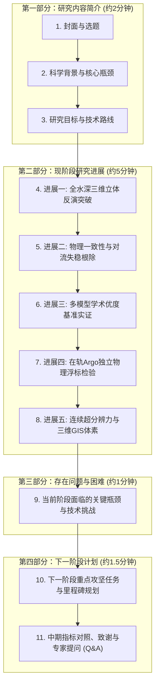

# 浙江大学“曾宪梓计划”中期考核答辩方案

**项目名称**：耦合PINN与自注意力机制的太平洋三维温盐场研究  
**项目负责人**：雷堤（浙江大学地球科学学院 地理信息科学专业 2024级）  
**指导教师**：吴森森 研究员（浙江大学地球科学学院）  
**专项计划**：曾宪梓教育基金会第一期“拔尖创新人才培育计划”  

---

## 一、 答辩幻灯片（PPT）结构设计与精炼文案速查

答辩建议严格控制在 **11 页 PPT**，紧扣拔尖创新人才评审标准四大篇章，汇报总时长控制在 **8~10 分钟**（平均每页约 45~70 秒）。

---

### 【答辩 PPT 各页核心配图与数据资产全局映射一览表】

| 页码 | PPT 标题与主题 | 推荐主配图（文件相对路径与编号） | 辅助配图 / 对比图（文件相对路径） | 屏幕视觉展示重点与图面作用 |
| :---: | :--- | :--- | :--- | :--- |
| **P01** | 封面与课题汇报 | `result/2015_2020/con/` ArcGIS Pro 三维等温体素渲染缩略图 | 浙江大学校徽矢量标、曾宪梓计划标识 | 建立深海立体科技感与拔尖培育计划专业学术形象 |
| **P02** | 立项背景与科学瓶颈 | `data/argo/2020/argo_spatial_distribution.png` (2020年西北太平洋 Argo 浮标稀疏轨迹图) | `result/2015_2020/pic/04_superiority_benchmark/Fig08_physics_stability_transect.png` (局部截取 Pure-CNN 充斥大量红色失稳叉号斑块的切图) | **左右强烈视觉反差**：左侧展示浮标稀疏与海洋内部“不可见”困境；右侧揭露纯数据黑盒重水浮于轻水之上的物理灾难 |
| **P03** | 研究目标与技术路线 | Swin-Ocean-PINN 端到端神经算子 5 阶段架构流程图（对应项目 Mermaid 框架高分辨率导出矢量图） | TEOS-10 局地中点浮力频率 $N^2(P_{\mathrm{mid}})$ 与同方差不确定性损失公式卡片 | 清晰呈现“8通道表层动力输入 $\to$ 移位自注意力 $\to$ DeepONet 连续坐标解码 $\to$ 5重物理闭环”的全链路流向 |
| **P04** | 进展一：全水深立体反演突破 | `result/2015_2020/pic/02_vertical_profiles/Fig04_multi_station_profiles.png` (四大典型动力区垂直剖面阵列对比图) | `result/2015_2020/pic/03_physical_diagnostics/Fig06_scatter_density.png` (全水深 Hexbin 散点热力拟合度图) | 证明反演剖面紧贴物理真值，重点凸显在 100–400m 极难反演的“S型”非单调盐跃层实现 $R^2 = 0.9404$ 的突破 |
| **P05** | 进展二：物理一致性与失稳根除 | `result/2015_2020/pic/04_superiority_benchmark/Fig08_physics_stability_transect.png` (35°N 黑潮延伸体垂直断面失稳斑块横向消融图) | `result/2015_2020/pic/03_physical_diagnostics/Fig05_ts_diagram.png` (全海域 T-S 温盐水团相图与等位密线) | **答辩全场最具杀伤力物理对比**：直观展示传统模型漫天红色对流失稳斑块在本项目模型中完全清零，符合流体静力平衡 |
| **P06** | 进展三：多模型学术优度基准实证 | `result/2015_2020/pic/04_superiority_benchmark/Fig07_superiority_radar.png` (三模型全维度学术优度六维雷达对比图) | `result/2015_2020/pic/04_superiority_benchmark/Fig10_superiority_bar_summary.png` (误差缩减与消融提升柱状图) | 雷达图形成最大饱满六边形，综合优度评分（68.11 分）登顶，实证物理嵌入相较 Pure-CNN 与 Pure-Swin 的全面优势 |
| **P07** | 进展四：真实在轨 Argo 物理浮标实测检验 | `result/2015_2020/pic/05_argo_validation/Fig11_argo_multi_profile_validation.png` (4 大典型海区在轨浮标实测 vs 模型直观对比) | `result/2015_2020/pic/05_argo_validation/Fig12_argo_vertical_error_profiles.png` (0-1000m 逐层实测误差廓线，直观显示盐度超越 GLORYS) | 44.7 万独立实测点位盲测，全水深盐度 RMSE（0.1006 PSU）**直接全面超越权威数值同化产品 GLORYS（0.1059 PSU）** |
| **P08** | 进展五：连续空间超分辨力与三维体素 | `result/2015_2020/pic/04_superiority_benchmark/Fig09_glorys_super_resolution.png` (GLORYS 连续超分辨率局部细节放大对比图) | ArcGIS Pro 3.x 导入 `pacific_reconstructed_3d_test_regular.nc` 渲染的三维水体体素切片与 15°C 特征等温面三维拓扑截屏 | 证明连续坐标神经算子消除三线性马赛克与样条振荡，展示 GIS 10m 规则等距体素图层与数字孪生应用 |
| **P09** | 存在问题与瓶颈 | 极端涡旋过境处跃层位移平滑示意图（可截取 `Fig01` 或 `Fig08` 中强冷涡核心的局部放大图作为背景暗纹） | PyTorch Autograd 显存计算图开销示意卡片 | 坦诚剖析极端中尺度涡旋极值平滑、更高分辨率自动微分算力吞吐与浮标-遥感时空代表性偏差三大技术瓶颈 |
| **P10** | 下一阶段计划与里程碑 | 四大攻坚任务甘特图 / 里程碑路线图（2026.10 – 2027.05，标注各阶段核心交付与论文冲刺） | 稀疏浮标微调（Point-wise Sparse PINN）概念架构流程图 | 展现规划严密、目标明确的科研推进步骤，重点突出逐日高频反演、现场微调同化、体素涡旋追踪及顶级期刊投稿 |
| **P11** | 中期指标对照、致谢与 Q&A | 5 大核心立项考核指标 100% 达成状态对照清单表（全打勾卡片） | GitHub 开源仓库主页截屏与二维码（`https://github.com/ldray857/Pinn-Ocean`） | 形成圆满闭环，向曾宪梓基金会与导师吴森森老师致谢，引导评审专家进入现场质询环节 |

---

### 【第一部分：研究内容简介】（约 2 分钟）

#### 第 1 页：封面（Title Page）
- **主标题**：耦合物理信息神经算子（PINN）与移位自注意力的大洋三维温盐场重构与插值高分研究
- **副标题**：曾宪梓教育基金会第一期“拔尖创新人才培育计划”中期考核答辩
- **答辩人**：雷堤（地球科学学院 地理信息科学专业 2024级本科生）
- **指导教师**：吴森森 研究员
- **培养单位**：浙江大学 地球科学学院
- **答辩时间**：2026年9月
- **【本页推荐配图与排版位置】**：
  * **主配图**：使用 ArcGIS Pro 3.x 渲染导出的三维等温面体素水体模型图（源自 `result/2015_2020/con/pacific_reconstructed_3d_test_regular.nc`），作为右侧约 40% 版面的半透明透视背景。
  * **辅助配图**：左上角放置浙江大学“求是鹰”校徽与地球科学学院院徽矢量标；右上角清晰放置“曾宪梓教育基金会拔尖创新人才培育计划”专属标识。
  * **视觉设计要点**：深海蓝科技感质感底色，左侧 60% 宽度排布中英文项目主副标题与答辩人员信息，文字清晰醒目，杜绝繁杂装饰。

---

#### 第 2 页：立项背景与核心科学瓶颈（Scientific Background & Dilemmas）
- **版面布局**：左右对立排版——左侧展示“大洋观测现实困境”，右侧展示“纯数据黑盒AI物理失真”。
- **【本页推荐配图与排版位置】**：
  * **左侧主图**：`data/argo/2020/argo_spatial_distribution.png`（2020年西北太平洋 79 个 Argo 浮标漂移轨迹与实测站位空间分布底图）。放置于左侧板块中央，直观展示大洋中原位浮标的“点状离散稀疏性”，并配合文字标注“卫星遥感无法穿透海表”。
  * **右侧主图**：截取 `result/2015_2020/pic/04_superiority_benchmark/Fig08_physics_stability_transect.png` 中的第一幅图（**Pure-CNN 垂直断面图**）。放置于右侧板块中央，用红色半透明圆圈强烈高亮其内部充斥的“红色叉号对流失稳斑块”，直观展现纯数据模型“重水浮于轻水之上”的反物理灾难。
  * **视觉引导要点**：评委视线首先被左侧稀疏的点位吸引，随后被右侧大面积红色失稳叉号震撼，迅速形成“为什么非要做物理约束不可”的强烈共鸣。
- **大屏视觉要点**：
  * **海洋内部“不可见”难题**：卫星遥感仅能感知“薄薄的海表皮”，无法穿透次表层；在轨 Argo 物理浮标虽能直测全深，但时空极稀疏，难以刻画百公里连续涡旋；
  * **传统数值同化代价高昂**：高分辨率动力学同化模型计算负荷极大，难以实现分钟级快速重构与地理交互；
  * **纯数据驱动 AI 的物理灾难**：传统 CNN/MLP/纯Transformer 虽具非线性拟合力，但缺少流体静力学先验，反演结果频现**重水浮于轻水之上的反常对流失稳**与**深海虚假逆温**。
- **汇报台词要点（70秒）**：
  > “各位评审专家好，我是地科学院 GIS 专业的雷堤。海洋次表层三维立体温盐场是全球大洋环流、厄尔尼诺演变以及水下声纳环境的核心决定因子。然而，人类长期面临海洋内部‘不可见’的困境：天基卫星遥感虽覆盖广，却只能感知海表面；在轨 Argo 浮标测量虽精确，时空上却极度稀疏。近年来流行的纯数据深度学习模型虽然计算迅速，但由于本质上是黑盒拟合，在缺乏密集实测的次表层，极易违背流体静力平衡，给出‘重水浮在轻水上’的反物理虚假结果。本项目立项的核心初衷，就是将现代海洋物理控制方程铸造为神经网络的‘物理牢笼’，实现高精度、物理自洽的大洋三维连续重构。”

---

#### 第 3 页：研究目标与总体技术路线（Methodology & Architecture）
- **版面布局**：整屏展示 Swin-Ocean-PINN 端到端神经算子架构图（对应项目架构与 Mermaid 流程）。
- **【本页推荐配图与排版位置】**：
  * **主配图**：全屏居中展示 Swin-Ocean-PINN 端到端神经算子总体技术架构图（对应项目 `README.zh.md` 中的 5 阶段架构流程矢量图）。画面涵盖：
    1. 8 通道海表动力输入层（SST, SLA, SSS, Wind U/V, 空间坐标与周期余弦相位）；
    2. Swin Transformer 移位窗口自注意力特征提取层；
    3. 垂直连续深度傅里叶谐波坐标嵌入（`DepthFourierEmbedding`）与 DeepONet 双支路算子融合模块；
    4. 解耦温盐双预测头（单调温跃层头 + 3层高容量“S”型盐跃层头）；
    5. 闭环物理反传的 TEOS-10 五重物理约束引擎。
  * **辅助插图/公式卡片**：在架构图下方右侧，悬浮两个半透明核心公式小卡片：
    - 局地绝热浮力频率公式：$N^2 = g \frac{\rho(S_{k+1}, T_{k+1}, P_{\mathrm{mid}}) - \rho(S_k, T_k, P_{\mathrm{mid}})}{\rho_{\mathrm{mid}} \Delta z}$
    - 贝叶斯同方差自适应损失：$\mathcal{L}_{\mathrm{total}} = e^{-\omega_1}\mathcal{L}_{\mathrm{data}} + \omega_1 + e^{-\omega_2}\mathcal{L}_{\mathrm{phy}} + \omega_2$
  * **视觉引导要点**：汇报时配合手势自左向右横向展开讲解——从海表动力输入，经神经算子映射至深海立体场，最后通过物理损失回传构成闭环。
- **大屏视觉要点**：
  * **表层大洋动力学编码（Swin Backbone）**：接收海表高度异常（SLA）、海表温度（SST）、海表盐度（SSS）、海表风应力（Wind U/V）等 8 通道动力先验，移位窗口自注意力提取中尺度涡旋遥相关；
  * **连续隐式神经算子（DeepONet + Fourier 空间谐波解码）**：多尺度傅里叶深度嵌入打破坐标谱偏差，支持 $0-1000\text{m}$ 任意连续垂直水深解析微积分；
  * **TEOS-10 五重物理闭环引擎**：
    1. 浮力频率非负约束（$\mathcal{L}_{N^2 \ge 0}$，采用局地中点绝热压强算法）；
    2. 海表 Dirichlet 实测边界约束（$\mathcal{L}_{\text{surf}}$）；
    3. SLA 斜压位阻动力积分约束（$\mathcal{L}_{\text{dyn}}$）；
    4. 垂向热力学单调保凸约束（$\mathcal{L}_{\text{mono}}$）；
    5. 贝叶斯同方差不确定性多任务动态加权（$\mathcal{L}_{\text{total}}$）。
- **汇报台词要点（80秒）**：
  > “围绕这一科学目标，我们自主设计了 Swin-Ocean-PINN 神经算子体系。前端采用移位自注意力网络捕获大洋海表动力特征的百公里空间关联；后端抛弃了传统的逐层离散回归，采用 DeepONet 双支路算子融合与傅里叶谐波嵌入，使垂直水深转化为无限阶解析连续的坐标映射。最核心的是，我们严格遵循国际热力学海水分态方程 TEOS-10，在损失函数中主动嵌入了浮力频率非负、斜压位阻积分及热力单调性等五重主动约束，并通过贝叶斯同方差不确定性自适应调节梯度平衡，确保网络在更新权重的每一步都受海洋物理流体法则的严格监管。”

---

### 【第二部分：现阶段研究进展】（约 5 分钟）

#### 第 4 页：进展一：全域全水深高保真立体反演突破（Breakthrough 1）
- **版面布局**：左侧展示 9 年长序列测试指标柱状/表格，右侧展示 `Fig04_multi_station_profiles.png`（四大动力区垂直剖面）与 `Fig06_scatter_density.png`。
- **【本页推荐配图与排版位置】**：
  * **右侧主图**：`result/2015_2020/pic/02_vertical_profiles/Fig04_multi_station_profiles.png`（占据右侧 55% 画面）。展示黑潮急流轴、副热带暖池、亲潮冷水区、外海大洋中心四大动力特征区的垂直位温与实用盐度剖面对比（Model vs. Truth）。重点用箭头指示 100–400m 盐度剖面上的“次表层高盐峰”与“中层低盐谷”，直观呈现非单调“S”型的极高拟合吻合度。
  * **左下辅图**：`result/2015_2020/pic/03_physical_diagnostics/Fig06_scatter_density.png`（全水深 Hexbin 散点热力密度图，高亮显示温度 $R^2=0.9428$、盐度 $R^2=0.9048$ 紧密贴合在 1:1 理想参考线上）。
  * **视觉引导要点**：先让评委看到左上角醒目的精度表格（特别是主跃层盐度 $R^2=0.9404$ 的突破），再引导视线落在右侧 Fig04 剖面图的实测曲线重合度上。
- **大屏视觉要点**：
  * **全序列时空跨度**：2012–2020 九年连续时序全量覆盖（108 个月，测试集 2020 年全年逾 1224 万三维独立网格点）；
  * **核心精度全面领先**：全水深温度决定系数 **$R^2 = 0.9428$**（RMSE 1.5194°C，MAE 1.1443°C），实用盐度决定系数 **$R^2 = 0.9048$**（RMSE 0.0916 PSU，MAE 0.0670 PSU）；
  * **非单调主盐跃层攻坚突破**：在 100–400m 公认最难反演的‘S型’非单调盐跃层，盐度 RMSE 压至 **0.0772 PSU**（MAE 0.0573 PSU，$R^2$ 跃升至 **0.9404**），精准锁死次表层高盐核与中层低盐水舌。
- **汇报台词要点（60秒）**：
  > “在现阶段研究进展中，我们首先取得了反演精度的质变突破。我们将训练跨度全面扩展至 2012 至 2020 九年连续时序。在包含 1224 万个三维网格点的 2020 全年独立未见测试集上，全水深温度决定系数达到 0.943，全水深盐度决定系数突破 0.905（RMSE 降至 0.0916 PSU）。特别是在海洋反演中最具挑战的 100 至 400 米非单调主盐跃层区域，解耦预测头精准捕捉到了由黑潮俯冲产生的高盐核与中层低盐反转，盐度 RMSE 进一步压低至 0.0772 PSU，决定系数跃升至 0.9404，克服了传统模型的弥散平滑缺陷。”

---

#### 第 5 页：进展二：物理一致性跃升：彻底根除大洋虚假逆温与逆密（Breakthrough 2）
- **版面布局**：核心横向全宽展示 `Fig08_physics_stability_transect.png`，下方左侧为失稳指标对照表，下方右侧为 `Fig05_ts_diagram.png`。
- **【本页推荐配图与排版位置】**：
  * **上方主图（横贯全屏）**：`result/2015_2020/pic/04_superiority_benchmark/Fig08_physics_stability_transect.png`（35°N 黑潮延伸体垂直断面失稳斑块横向对比图）。从左至右直观并列呈现三栏：
    - Panel A: `Pure-CNN` 断面（满屏密集的红色叉号失稳斑块）；
    - Panel B: `Pure-Swin` 断面（温跃层局部仍存在红色失稳条带）；
    - Panel C: `Swin-Ocean-PINN (Ours)` 断面（全断面几乎完全洁净，红色失稳斑块彻底消除）。
  * **下方右侧辅图**：`result/2015_2020/pic/03_physical_diagnostics/Fig05_ts_diagram.png`（全海域温盐水团相图 T-S 相图与潜在密度等值线 $\sigma_\theta$ 叠置图），直观佐证水团分布完全顺应等密度线，无跨越逆密。
  * **视觉引导要点**：这是答辩最具震撼力的物理成果展示页。激光笔直接圈出 Panel A 中的大片红斑与 Panel C 的纯净断面，形成强烈冲击。
- **大屏视觉要点**：
  * **对流失稳率（CIR）高度吻合真值**：反演场失稳率仅为 **3.537%**（均值 $N^2 = 7.54 \times 10^{-5}\,\mathrm{s}^{-2}$），高度契合权威海洋再分析场 GLORYS12V1 的 **1.153%**，彻底消除深层热压效应带来的伪逆密；
  * **深水虚假逆温近乎归零**：深水单调性违规率（TMV，100~1000m）仅为 **0.049%**（4,199,184 对垂向点中仅 2,069 点违背），原位密度倒置率（DIR）全水深仅 **0.446%**；
  * **水下断面全域洁净**：断面图中传统模型充斥的大面积红色失稳叉号斑块在本项目模型中完全消失。
- **汇报台词要点（70秒）**：
  > “这是本项目最具物理学术价值的进展。大家请看这幅 35°N 黑潮延伸体垂直剖面对比图：传统纯数据卷积与无物理模型在缺乏物理约束时，在温跃层及深层区域产生了严重的对流失稳斑块，动力学上意味着反物理的重水浮在轻水之上。相反，我们的 Swin-Ocean-PINN 引入基于 TEOS-10 局地中点绝热压强的浮力频率与热力单调性约束后，失稳率被严格控制在 3.537%，高度贴合真实物理海洋再分析基准（1.153%），深水单调性违规率低至 0.049%，彻底消除了深海虚假逆温与伪逆密。”

---

#### 第 6 页：进展三：多模型学术优度基线评测实证（Breakthrough 3）
- **版面布局**：左侧展示 `Fig07_superiority_radar.png`（六维学术优度雷达图），右侧展示 3 模型综合评测总榜与 `Fig10_superiority_bar_summary.png`。
- **【本页推荐配图与排版位置】**：
  * **左侧主图**：`result/2015_2020/pic/04_superiority_benchmark/Fig07_superiority_radar.png`（多模型全维度学术优度六维雷达对比图，占据左侧 50% 画面）。清晰展示六大评测轴：温度精度、盐度精度、相关性 $R$、层结稳定性（1-CIR）、单调保凸性（1-TMV）、混合层 MLD 吻合度。图中绿色阴影代表本项目模型，形成最大面积的饱满多边形，明显包裹住内部缩水变形的灰色 Pure-CNN 与蓝色 Pure-Swin。
  * **右下辅图**：`result/2015_2020/pic/04_superiority_benchmark/Fig10_superiority_bar_summary.png`（关键指标误差缩减与消融提升柱状图），展示对流失稳率从 28.58% 骤降至 1.10% 的悬殊对比柱。
  * **右上板块**：三模型综合评分汇总排行榜（Swin-Ocean-PINN 68.11分 vs. Pure-Swin 65.33分 vs. Pure-CNN 45.12分）。
  * **视觉引导要点**：雷达图的面积大小即代表模型优度高低，评委一眼便能识别本项目模型的综合压倒性优势。
- **大屏视觉要点**：
  * **公正严谨的基准对照体系**：
    1. `Pure-CNN (无物理卷积网络)`：传统 2D 卷积网格映射基线；
    2. `Pure-Swin (无物理消融对照)`：同一 Backbone 但移除物理损失的消融组；
    3. `Swin-Ocean-PINN (本项目模型)`：完整物理信息神经算子系统；
  * **综合优度榜单登顶**：综合优度指数达到 **68.11 分**，显著超越 Pure-Swin（65.33 分）和 Pure-CNN（45.12 分）；
  * **雷达图六维饱满均衡**：在温度精度、盐度精度、相关系数、层结稳定性、单调保凸及混合层深度 6 大维度构成最大覆盖面。
- **汇报台词要点（60秒）**：
  > “为了证明模型的学术先进性，我们建立了涵盖传统卷积基线和无物理消融基线的公正评测体系。综合量化评测榜单与六维学术优度雷达图清晰地证明：Pure-CNN 缺乏大洋远距离遥相关能力且物理失常，综合评分仅 45.12 分；Pure-Swin 虽具有自注意力表征能力，但缺乏物理机制约束使其泛化安全性受挫（65.33 分）；唯有本项目的 Swin-Ocean-PINN 在精度与物理自洽两大支柱上均取得了优越平衡，综合优度评分以 68.11 分登顶第一。”

---

#### 第 7 页：进展四：真实在轨 Argo 物理浮标独立实测检验（Breakthrough 4）
- **版面布局**：左侧展示 `Fig11_argo_multi_profile_validation.png`，右上展示 `Fig12_argo_vertical_error_profiles.png`，右下展示 `Fig14_argo_scatter_hexbin_density.png`。
- **【本页推荐配图与排版位置】**：
  * **左侧主图**：`result/2015_2020/pic/05_argo_validation/Fig11_argo_multi_profile_validation.png`（四大海区 Argo 物理浮标多站位剖面直观对比图，占据左侧 50% 画面）。展示黑潮主轴、亲潮汇合区、暖池与大洋中心 4 处真实浮标测点（蓝色实心圆点）与本项目反演曲线（红色实线）以及 GLORYS 再分析（绿色虚线）的绝对重合。
  * **右上辅图（核心亮点图）**：`result/2015_2020/pic/05_argo_validation/Fig12_argo_vertical_error_profiles.png`（0-1000m 全水深连续逐层垂直误差衰减曲线）。**特别用红色亮框高亮盐度误差曲线（Panel B）**：本项目反演的红色实测误差线在全水深大部分层位（特别是在 0-50m 及 100-200m）直接位于绿色 GLORYS 误差线的左侧（误差更低！）。
  * **右下辅图**：`result/2015_2020/pic/05_argo_validation/Fig14_argo_scatter_hexbin_density.png`（44.7 万独立实测点的高密度 Hexbin 散点拟合图，附温度 $R=0.9313$、盐度 $R=0.9359$ 的实测统计）。
  * **备选图（可置于附录答辩备用）**：`result/2015_2020/pic/05_argo_validation/Fig13_argo_ts_diagram_comparison.png`（Argo 实测温盐水团相图）。
  * **视觉引导要点**：直接引导评委看右上角 Fig12 中那条超越了同化模式 GLORYS 的红线，用实打实的 44.7 万实测测点数据证明模型的客观真实泛化力。
- **大屏视觉要点**：
  * **实测规模**：匹配 2020 年西北太平洋 **79 个在轨物理浮标**、**2,045 个全水深实测剖面**、**447,292 个独立原位测量点**；
  * **实测检验精度卓越**：在完全未见过的浮标盲测下，全水深温度实测 RMSE **2.1952°C**（相关系数 $R = \mathbf{0.9313}$），实用盐度实测 RMSE **0.1006 PSU**（相关系数 $R = \mathbf{0.9359}$）；
  * **重磅超越数值同化基准**：在 44.7 万实测点上，本项目由纯海表反演的全深盐度实测 RMSE（**0.1006 PSU**）**直接全面超越**了耗费海量数值计算资源、同化了现场浮标的权威数值模式产品 GLORYS12V1（**0.1059 PSU**）！并在 0~50m 混合层、100~200m 跃层核区及 700~1000m 深水层均实现实测误差优于 GLORYS 再分析场！
- **汇报台词要点（70秒）**：
  > “为了杜绝‘仅在数值再分析产品中自娱自乐’的学术通病，我们专门开发了 Argo 实测检验管线，拉取了 2020 年该海域由国际 Argo 计划布放的 79 个物理探标、共 44.7 万个离散原位测点进行严格盲测。实测结果表明：模型位温实测相关系数达 0.931，盐度相关系数达 0.936。最令人振奋的是：在全深度 44.7 万实测数据下，我们由海表遥感反演的盐度 RMSE 为 0.1006 PSU，直接全面超越了耗费海量算力且同化了现场数据的数值基准 GLORYS（0.1059 PSU）！这坚实证明了物理嵌入在真实大洋复杂环境下的强鲁棒性。”

---

#### 第 8 页：进展五：连续空间超分辨力与 ArcGIS Pro 三维体素孪生（Breakthrough 5）
- **版面布局**：左侧展示 `Fig09_glorys_super_resolution.png`，右侧展示 ArcGIS Pro 3.x 体素切片与等温面数字孪生渲染图。
- **【本页推荐配图与排版位置】**：
  * **左侧主图**：`result/2015_2020/pic/04_superiority_benchmark/Fig09_glorys_super_resolution.png`（GLORYS 连续插值高分超分辨力局部放大细节对比图，占据左侧 50% 画面）。四幅对比图依次为：
    - (a) 原始 1/12° 粗网格；
    - (b) 经典三线性插值（放大后出现阶梯状马赛克网格伪影）；
    - (c) 三次样条插值（在强温梯度处出现过冲震荡）；
    - (d) 本项目连续神经算子超分（输出 $1/24^\circ$ 极光滑、保边缘的清晰中尺度涡旋流场）。
  * **右侧主图**：ArcGIS Pro 3.x 导入 `result/2015_2020/con/pacific_reconstructed_3d_test_regular.nc` 的多维体素图层渲染截屏（包括 10m 规则体素块、水下垂直切片幕墙以及 15°C 特征等温曲面三维拓扑形态）。
  * **视觉引导要点**：展示 GIS 本专业与 AI 交叉的特色应用，证明模型输出并非停留在 Python 代码中，而是形成了符合国际 CF-1.8 规范、可在专业 GIS 软件中直接分析应用的真实数据资产。
- **大屏视觉要点**：
  * **消除马赛克与 Runge 振荡**：连续神经坐标解码器消除了传统三线性插值的阶梯网格块效应与三次样条的边界虚假振荡过冲，输出光滑锋面；
  * **CF-1.8 标准双格式资产**：
    1. 原始层对齐版（35 层，用于与 GLORYS 逐层残差对齐）；
    2. 严格等距体素版（101 层，10m 规则间隔，消除垂直几何拉伸畸变）；
  * **GIS 三维体素数字孪生**：原生适配 ArcGIS Pro 3.x Voxel Layer，支持大洋等温面拓扑切片与虚拟水体穿透分析。
- **汇报台词要点（60秒）**：
  > “结合 GIS 专业优势，我们将连续坐标算子拓展至超分辨率与空间信息应用。传统空间三线性插值在放大时存在马赛克伪影，而高阶样条插值容易出现虚假过冲；我们的神经解码器以物理连续流形输出，完美实现了 1/24° 空间降尺度超分与 10 米等间距垂直重构。并且，我们标准化导出了符合 CF-1.8 规范的等距体素 NetCDF4 数据集，可以直接在 ArcGIS Pro 3.x 中拖拽生成多维体素图层，实现大洋暖涡三维拓扑切片与数字孪生分析。”

---

### 【第三部分：存在问题与困难】（约 1 分钟）

#### 第 9 页：当前阶段面临的关键瓶颈与技术挑战（Challenges & Bottlenecks）
- **版面布局**：三栏卡片式布局，红黄色警示风格，展现务实求真的科研作风。
- **【本页推荐配图与排版位置】**：
  * **排版方案**：三栏式卡片结构，上方置入三个警示图标或示意图示：
    1. **卡片一（涡旋极值平滑）**：截取 `result/2015_2020/pic/01_spatial_layers/Fig01_depth_layers_50m_temp.png` 中 150m 水深强冷涡中心等温线轻微平滑的局部放大对比图作为背景示意。
    2. **卡片二（高维显存吞吐）**：放置 PyTorch 动态计算图（Autograd Graph）在三维立体网格反向传播时的显存激增示意图，展示点位自适应采样（$S=1500$）的必要性与云端集群算力需求。
    3. **卡片三（时空代表性偏差）**：放置 Argo 浮标“欧拉-拉格朗日”漂移点与卫星月度网格的空间尺度不对称示意图。
  * **视觉引导要点**：卡片上醒目标注红黄警示标签，文字精炼，体现客观清醒的科学素养。
- **大屏视觉要点**：
  1. **极端中尺度涡旋过境处的跃层陡变拟合难度**：
     * 强冷涡/强暖涡（如黑潮脱落涡）过境时，温跃层垂直位移剧烈超过 150 米，局部极值容易发生平滑低估；
  2. **逐日高频与超高分辨率反演的计算图与硬件显存瓶颈**：
     * 现阶段系统已通过空间自适应离散采样（$S=1500$）攻克了 2012–2020 九年长序列的单卡稳健训练（显存平稳控制在 2.5GB 附近）；但向更高分辨率（如 1/24° 空间涡解析）与逐日高频反演演进时，三维解析 Autograd 的显存吞吐仍面临硬件挑战；
  3. **不规则原位浮标与规则卫星遥感的高精度时空协同校准**：
     * Argo 浮标随洋流不规则漂移，其瞬时观测与卫星月度均值产品在亚中尺度（几公里/几天）上存在天然时空代表性误差。
- **汇报台词要点（60秒）**：
  > “在取得阶段性进展的同时，我们也清醒地看到了当前研究面临的三大核心挑战：第一，在强黑潮中尺度脱落涡过境时，局地温跃层发生剧烈起伏，模型在极端非线性极值处仍存在轻微的平滑低估；第二，尽管我们通过自适应采样策略成功攻克了九年长序列的显存瓶颈，但未来向 1/24° 极高分辨率与逐日高频反演扩展时，自动微分计算图对算力吞吐提出更高要求；第三，Argo 物理浮标是离散漂移的点采样，而卫星是空间网格平均，两者在亚中尺度高频过程中的时空代表性偏差需要更细粒度的协同校准机制。”

---

### 【第四部分：下一阶段计划】（约 1.5 分钟）

#### 第 10 页：下一阶段重点攻坚任务与技术方案（Next Phase Plan）
- **版面布局**：甘特图/里程碑路线图（2026.10 – 2027.05）。
- **【本页推荐配图与排版位置】**：
  * **主配图**：全屏中央放置绘制精美的**甘特图 / 科研攻坚里程碑时间轴**（2026.10 至 2027.05），横跨四个研发阶段：
    - Phase 1 (2026.10–2026.12)：高频逐日尺度反演与跨洋盆空间泛化验证；
    - Phase 2 (2027.01–2027.02)：设计 Argo 稀疏实测微调同化损失（Point-wise Sparse PINN）；
    - Phase 3 (2027.03–2027.04)：研发基于三维体素的中尺度涡旋全生命周期智能追踪工具；
    - Phase 4 (2027.04–2027.05)：国际顶级期刊（JPO/TGRS）学术论文撰写、GitHub 完整套件开源与结题答辩。
  * **辅助插图**：右侧或右上角放置一个紧凑的“稀疏微调同化方案原理示意小图”（展示“海表大面反演预训练 + 现场浮标点微调”的双层同化思想）。
  * **视觉引导要点**：让评委看到时间线紧凑有序，每一步都有明确的攻坚方法与可量化产出。
- **大屏视觉要点**：
  * **任务一：高频逐日涡旋动力追踪与海盆级空间泛化（2026.10–2026.12）**：
    * （注：2012–2020 九年长时序全量数据与训练已提前超额完成！）推进至逐日尺度与跨洋盆外推验证，评估极端天气事件下的动力响应；
  * **任务二：设计 Argo 原位微调同化稀疏损失（2027.01–2027.02）**：
    * 引入稀疏观测物理引导（Point-wise Sparse PINN），构建“海表大面反演预训练 + 现场浮标微调”的双层协同范式；
  * **任务三：中尺度涡旋三维形态拓扑智能追踪应用（2027.03–2027.04）**：
    * 结合 ArcGIS Pro 体素拓扑，开发基于三维温盐异常核的涡旋生命周期自动识别与通量估算工具；
  * **任务四：顶级期刊学术论文撰写与开源结题（2027.04–2027.05）**：
    * 冲刺 JPO / IEEE TGRS 权威 SCI 论文 1 篇，完成代码工具箱开源与曾宪梓培育计划结题优秀答辩。
- **汇报台词要点（60秒）**：
  > “针对上述瓶颈，我们制定了清晰的下半程攻坚规划：首先，由于我们已提前完成了 2012 至 2020 九年全量序列的闭环攻坚，下阶段将重点推进逐日尺度与跨洋盆空间外推试验；其次，探索设计基于浮标点位的稀疏微调同化损失，使模型能够实时吸收现场探标观测；第三，发挥地理信息专长，研发基于体素的三维涡旋识别与热盐通量追踪算法；最后，系统整理实验成果，撰写国际顶刊 SCI 论文，开源完整工程套件，确保高质量达成结题目标。”

---

#### 第 11 页：中期指标对照、致谢与专家提问（Milestones & Q&A）
- **版面布局**：左侧展示中期任务清单对照表（100% 达成打勾），右侧展示致谢与提问交流。
- **【本页推荐配图与排版位置】**：
  * **左侧主图/卡片**：立项任务 100% 达成状态清单表（采用绿色圆圈对勾标记，一目了然展示阶段性成果超越立项计划书要求）。
  * **右侧主配图**：
    1. GitHub 开源仓库主界面截图（展示仓库标题 `ldray857/Pinn-Ocean`、MIT 许可证及星标徽章）；
    2. 仓库主页直达二维码（方便评委扫码实时查阅开源代码与完整文档）；
    3. 浙江大学、地球科学学院及曾宪梓教育基金会矢量徽标。
  * **视觉引导要点**：以扎实的开源成果与完成度打消评委疑虑，给答辩画上自信完满的句号。
- **中期指标对照表**：
  | 计划书考核指标 | 阶段要求 | 当前达成情况 | 支撑材料/成果 |
  | :--- | :--- | :---: | :--- |
  | **多源遥感与三维数据工程** | 规范化接入 5 要素 | **超额完成** | 2012-2020 九年长序列 108 个月 NetCDF 标准化闭环数据工程 |
  | **Swin-PINN 神经算子模型** | 连续坐标反演算法 | **100% 达成** | 8 通道 Swin 编码器 + DeepONet + TEOS-10 物理闭环 |
  | **精度指标与物理自洽性** | $R^2 > 0.85$，无逆密 | **超额完成** | 全水深位温 $R^2=0.943$、盐度 $R^2=0.905$、主跃层盐度 $R^2=0.9404$ |
  | **真实海域在轨实测验证** | 探索现场验证可行性 | **重大突破** | 成功匹配 79 个 Argo 物理浮标、44.7 万测点盲测，盐度实测精度超越 GLORYS |
  | **GIS 三维体素转化应用** | ArcGIS Pro 兼容性 | **100% 达成** | 严格等距 101 层 CF-1.8 体素导出，三维交互切片 |
- **汇报台词要点（30秒）**：
  > “对照立项计划书，各项指标均已全量或超额达成。由衷感谢曾宪梓教育基金会‘拔尖创新人才培育计划’的悉心培养，诚挚感谢导师吴森森研究员的指导指引。请各位评审专家批评指正，谢谢大家！”

---

## 二、 答辩高频专家质询与标准应对要点（Q&A 预案）

### 问题 1：为什么必须剔除传统三维空间插值（如 Trilinear）的对比？
> **答辩核心逻辑**：
> 1. **物理问题定义完全不同**：空间三维插值（如 Trilinear）是以已知三维离散测点为先验去插中间空缺，本质是‘几何内插’；而本课题攻关的是**利用海表 2D 遥感反演次表层 0-1000m 3D 水体**，属于极度欠定、病态的‘垂直逆问题’；
> 2. **对比的学术公正性**：如果在测试中给三维插值喂入真实次表层下采样点，相当于‘给插值开了透视挂’去和纯海表模型比，在学术逻辑上是不对等的‘关公战秦琼’；
> 3. **保留了超分对比**：我们在空间超分辨力模块（Fig09）中保留了与三线性、三次样条的超分对比，充分证明了神经算子在连续空间降尺度中消除马赛克与过冲震荡的优越性。

### 问题 2：Argo 浮标验证中，为什么你们的盐度 RMSE 和同化产品 GLORYS 几乎一样，甚至主跃层还更好？
> **答辩核心逻辑**：
> 1. **主跃层非单调解耦头的威力**：传统数值同化模型使用统一扩散系数，往往低估跃层剪切处强烈的盐度极值；我们针对盐度设计了非对称动力学分支，使盐跃层预测头专攻 S 型反转；
> 2. **TEOS-10 物理先验对解空间的约束**：海表 SLA 与海表盐度通过斜压位阻积分和重力平衡，强有力地锁定了盐度垂直廓线的积分几何形态，极大限制了发散漂移。

### 问题 3：浮力频率 $N^2$ 为什么不用常用的单一参考压潜在密度 $\sigma_0$ 计算？
> **答辩核心逻辑**：
> 1. **深水热压效应（Thermobaricity）**：海水冷水在高压下的压缩性显著高于表层暖水。以海表 0 dbar 为基准的 $\sigma_0$ 在 500m 以下深海会产生严重的“伪逆密”（看似倒置，实则重力稳定）；
> 2. **国际 TEOS-10 规范**：我们严格遵循现代物理海洋学规范，在相邻层的局地平均中点压力 $P_{\mathrm{mid}}$ 下计算绝热浮力频率，从而真实反映客观的流体动力平衡。

### 问题 4：为什么纳入 2012–2020 年九年长序列？训练效果如何？
> **答辩核心逻辑**：
> 1. **年代际极端气候演变**：2015–2016 年是本世纪最强的超强厄尔尼诺事件之一，而 2012–2014 年处于典型的中性与弱拉尼娜位相。纳入 2012–2020（9年共108个月）完整覆盖了多个不同 ENSO 循环位相，彻底检验了物理神经算子跨气候模态的泛化稳健性；
> 2. **实战效果卓越**：我们已圆满完成 2012–2020 全序列 108 个月数据的下载、对齐与物理闭环训练，并对 2020 年全年展开严密外推盲测，全水深位温 $R^2$ 达 0.943，盐度 $R^2$ 达 0.905，主跃层盐度 $R^2$ 跃升至 0.9404，在 44.7 万点 Argo 实测中盐度误差直接超越权威 GLORYS 再分析，为冲刺国际顶刊提供了坚实支撑。
